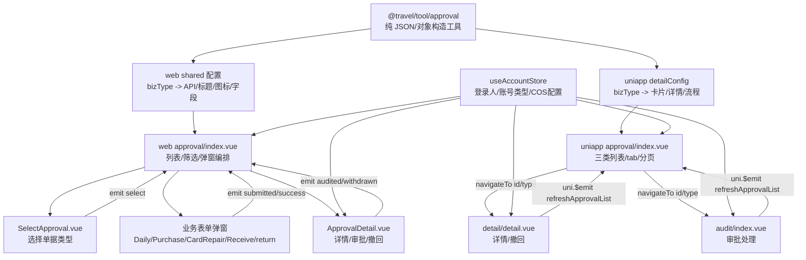

# approval 模块组件通信与 JSON 配置链路

## 分析范围

本笔记分析这三组目录：

- `travel-web/packages/tool/src/approval/`
- `travel-web/sites/web/src/pages/approval/`
- `travel-web/sites/uniapp/src/packageApproval/`

重点不是逐行解释代码，而是按组件通信思路回答四个问题：

1. 状态被谁持有。
2. 方法被谁触发。
3. 数据传给谁。
4. 改完之后怎么回流。

另外要特别注意：这里大量逻辑不是传统组件 props，而是“JSON 配置 / 对象配置 / 映射表”驱动的页面渲染。

## 总体结论

approval 模块是一个“配置驱动 + 页面容器编排 + 弹窗局部表单 + 详情页二次拉取”的结构。

核心分层如下：

| 层级 | 文件/目录 | 类型 | 真实职责 |
| --- | --- | --- | --- |
| 公共配置工具层 | `packages/tool/src/approval/flow.js` | 纯数据工具 | 把后端 `workflowConfig`、审批状态、节点扩展 JSON 转成流程时间线数组 |
| 公共配置工具层 | `packages/tool/src/approval/detailFields.js` | 纯数据工具 | 按 `bizType` 把详情对象转成字段行数组或结构化对象 |
| web 配置胶水层 | `sites/web/src/pages/approval/shared/*.js` | 页面业务配置 | 把 `bizType` 映射到接口、标题、图标、撤回重开弹窗 |
| web 页面容器 | `sites/web/src/pages/approval/index.vue` | 页面组件/容器组件 | 持有列表、筛选、分页、弹窗显隐、当前详情 |
| web 表单弹窗 | `components/Daily.vue`、`Purchase.vue`、`CardRepair.vue`、`Receive.vue`、`return.vue` 等 | 业务区块组件 | 持有当前弹窗内短生命周期表单状态，提交后通知父级刷新 |
| web 详情弹窗 | `components/ApprovalDetail.vue` | 业务区块组件 | 根据父级传入的基础数据再拉详情，处理审批、撤回、岗位反馈上传 |
| uniapp 列表页 | `packageApproval/approval/index.vue` | 页面组件/容器组件 | 持有 tab、分页、三类列表、当前登录人审批判断 |
| uniapp 详情/审核页 | `detail/detail.vue`、`audit/index.vue` | 页面组件/容器组件 | 通过路由 query 拉详情，处理撤回/审批后用 `uni.$emit` 通知列表刷新 |

## JSON 配置与真实状态的区别

这个模块里容易混淆的一点是：很多对象看起来像“状态”，但实际只是渲染配置。

| 内容 | 位置 | 是不是 source of truth | 说明 |
| --- | --- | --- | --- |
| `approvalBizTypeConfig` | `uniapp/approval/detailConfig.js`、web 的 display 配置 | 不是 | 单据类型到卡片字段、标题、类型、弹窗名的配置 |
| `detailApiMap` | web/uniapp shared 配置 | 不是 | `bizType -> API` 的请求映射 |
| `bizTypeTitleMap`、`bizTypeIconMap` | web/uniapp 配置 | 不是 | 页面展示文案和图标资源配置 |
| `statusUiMap`、`searchStatusMap` | 配置文件 | 不是 | 后端状态到前端筛选/颜色/文案的转换表 |
| `buildApprovalDetailFields()` 返回值 | `@travel/tool/approval` | 不是 | 后端详情对象的派生渲染结构 |
| `buildApprovalFlows()` 返回值 | `@travel/tool/approval` | 不是 | 后端流程对象的派生时间线结构 |
| `approvalList`、`pendingList`、`doneList`、`myList` | 页面组件 | 是页面级状态 | 接口返回结果经配置格式化后的页面列表 |
| 弹窗 `form`、`receiveForm`、`returnForm` | 表单弹窗组件 | 是局部短生命周期状态 | 只服务当前弹窗填写和提交 |
| `fetchedDetail` | 详情/审核页面或弹窗 | 是当前详情页状态 | 通过详情接口二次拉取，驱动详情字段、流程、权限判断 |

一句话判断：配置对象只描述“怎么展示/怎么映射”，不拥有业务事实；业务事实来自接口详情、列表接口、当前登录人 store 和当前表单输入。

## web 端组件分层表

| 组件/模块 | 组件类型 | 持有状态 | 接收数据 | 发出动作 |
| --- | --- | --- | --- | --- |
| `approval/index.vue` | 页面组件/容器组件 | `approvalList`、`pagination`、`search`、各类弹窗 visible、`currentApprovalDetail`、撤回重提编辑数据 | 路由 query、接口返回、accountStore | 打开弹窗、刷新列表、清空路由 query、处理撤回重开 |
| `SelectApproval.vue` | 业务区块组件 | 选择弹窗显隐 | `v-model:visible` | `select(type)` 通知父组件打开对应单据弹窗 |
| `Daily.vue` | 业务区块组件 | 日常报销表单、附件上传状态、提交状态 | `mode`、`editData`、`v-model:visible` | `submitted` |
| `Purchase.vue` | 业务区块组件 | 采购报销表单、关联采购单列表、编辑同步状态 | `mode`、`editData`、`v-model:visible` | `submitted` |
| `CardRepair.vue` | 业务区块组件 | 补卡表单 | `mode`、`editData`、`v-model:visible` | `submitted` |
| `Receive.vue` | 业务区块组件 | 物料领用表单 | `row`、`v-model:visible` | `success` |
| `return.vue` | 业务区块组件 | 归还/报废表单、类型切换状态 | `row`、`v-model:visible` | `success` |
| `ApprovalDetail.vue` | 业务区块组件 | `fetchedDetail`、审批意见、撤回状态、岗位反馈凭证上传状态 | `data`、`v-model:visible` | `audited`、`withdrawn(payload)` |

## web 端关键链路

### 1. 列表加载链路

| 环节 | 说明 |
| --- | --- |
| 状态持有者 | `approval/index.vue` 持有 `search`、`pagination`、`approvalList` |
| 触发者 | `onMounted`、筛选 watch、分页 `@change`、提交/审批/撤回事件 |
| 执行者 | `fetchApprovalList()` |
| 数据来源 | `getAllFormPage(params, true)` |
| JSON 配置参与点 | `buildApprovalCard(item, currentUserId)` 使用 `approvalBizTypeConfig`、`statusUiMap` 把后端单据转成卡片结构 |
| 回流 | 接口返回后更新 `approvalList`，模板重新渲染卡片 |

### 2. 新建单据链路

| 环节 | 说明 |
| --- | --- |
| 状态持有者 | 父级持有“哪个弹窗打开”；子弹窗持有具体表单 |
| 触发者 | `SelectApproval.vue` 点击单据类型 |
| 执行者 | 子组件 `emit('select', value)`，父组件 `openDocDialog(type)` |
| 数据传递 | 父组件通过 `v-model:visible` 控制弹窗，通过 `mode/editData/deptOptions/row` 传入必要值 |
| 回流 | 子弹窗提交成功后 `emit('submitted')` 或 `emit('success')`，父组件刷新列表 |

这里传递的是两类东西：

- `v-model:visible` 传的是控制权：父组件决定弹窗是否打开，子组件可以关闭自身。
- `submitted/success` 传的是动作：子组件只表达“我提交成功了”，父组件决定刷新哪些页面状态。

### 3. 撤回并重提交链路

| 环节 | 说明 |
| --- | --- |
| 状态持有者 | `approval/index.vue` 持有撤回后的编辑数据和弹窗显隐 |
| 触发者 | `ApprovalDetail.vue` 内点击撤回 |
| 执行者 | `ApprovalDetail.vue` 调 `withdrawFormBase`，成功后 `emit('withdrawn', payload)` |
| 数据传递 | payload 包含 `id`、`bizType`、`detail` |
| JSON 配置参与点 | `withdrawnResubmitDialogMap` 决定撤回后打开哪个编辑弹窗 |
| 回流 | 父组件先刷新列表，再把详情写入 `docDialogEditData`，打开对应弹窗 |

这个链路里，`ApprovalDetail.vue` 不直接打开编辑弹窗，因为它不是页面级编排者。它只负责撤回动作和把结果抛给父级。

### 4. 审批详情链路

| 环节 | 说明 |
| --- | --- |
| 状态持有者 | 父级持有 `currentApprovalDetail`，详情弹窗持有 `fetchedDetail` |
| 触发者 | 点击卡片详情 |
| 执行者 | 父级 `openApprovalDetail(item)` 先构造基础 payload，详情弹窗打开后 `fetchDetail()` 二次拉详情 |
| 数据传递 | 父传子 `:data="currentApprovalDetail"` |
| JSON 配置参与点 | `buildApprovalDetailFields()` 构造详情字段，`buildApprovalFlows()` 构造流程时间线 |
| 回流 | 审批成功 `emit('audited')`，父级刷新列表 |

这里采用“父级给基础数据 + 子级二次拉完整详情”的方式，优点是列表卡片不需要携带所有详情字段，详情弹窗能拿到最新流程状态。

### 5. 岗位反馈末级审批链路

| 环节 | 说明 |
| --- | --- |
| 状态持有者 | `ApprovalDetail.vue` 或 uniapp `audit/index.vue` 持有处理结果、凭证上传状态 |
| 触发者 | 当前审批人点击同意/驳回 |
| 执行者 | 审批页校验末级节点，上传图片，调用 `auditFormBase` |
| 数据传递 | `extra.processResult` 和 `extra.evidenceUrls` 作为后端扩展 JSON 传回 |
| JSON 配置参与点 | `flow.js` 里的节点扩展 JSON 解析会在后续详情展示时提取处理结果和凭证 |
| 回流 | 审批成功后关闭弹窗/返回上一页，并刷新列表 |

这个场景不是普通 `remark` 审批，而是“审批动作 + 业务处理结果 + 凭证图片”的组合，因此适合由详情/审核页本地持有临时输入，提交时一次性写回接口。

## uniapp 端组件分层表

| 页面 | 组件类型 | 持有状态 | 数据入口 | 回流方式 |
| --- | --- | --- | --- | --- |
| `approval/index.vue` | 页面组件/容器组件 | `activeTab`、三组列表、分页、加载状态、撤回 loading | `getAllFormPage`、`accountStore` | `uni.$on('refreshApprovalList')`、下拉刷新、触底加载 |
| `detail/detail.vue` | 页面组件/容器组件 | `itemId`、`itemType`、`status`、`fetchedDetail`、撤回 loading | 路由 query、详情接口 | 撤回后 `uni.$emit('refreshApprovalList')` 并返回 |
| `audit/index.vue` | 页面组件/容器组件 | 审批意见、最终处理结果、上传文件、详情数据、提交 loading | 路由 query、详情接口 | 审批后 `uni.$emit('refreshApprovalList')` 并返回 |
| `approval/detail.vue` | 详情页 | `itemId`、`itemType`、`fetchedDetail` | 路由 query、详情接口 | 只展示，不负责列表刷新 |
| `approval/detailConfig.js` | JSON 配置模块 | 无真实状态 | `bizType`、详情对象 | 输出卡片字段、详情字段、流程数组 |

## uniapp 端关键链路

### 1. 列表页 tab 与分页链路

| 环节 | 说明 |
| --- | --- |
| 状态持有者 | `approval/index.vue` |
| 触发者 | 页面首次进入、切换 tab、触底加载、下拉刷新、全局刷新事件 |
| 执行者 | `fetchApprovalList(isLoadMore)` |
| 数据来源 | `getAllFormPage(params, true)` |
| JSON 配置参与点 | `bizTypeTitleMap`、`bizTypeIconMap`、`buildCardLines()` |
| 回流 | 更新 `pendingList`、`doneList` 或 `myList` |

uniapp 列表没有使用 props/emit 的父子通信，因为这几个页面是路由页面关系。它用 query 传 id/type，用 `uni.$emit` 通知列表刷新。

### 2. 去详情/审核页链路

| 环节 | 说明 |
| --- | --- |
| 状态持有者 | 列表页持有卡片列表，详情/审核页持有当前详情 |
| 触发者 | 点击卡片 |
| 执行者 | `goDetail(item)` |
| 数据传递 | `uni.navigateTo({ url: ...id=${item.id}&type=${item.type} })` |
| 回流 | 详情/审核页重新通过 id/type 拉详情 |

这里传递的是最小路由参数，不把整个单据对象塞进路由。这样页面刷新、深链进入、返回后重拉都会更稳定。

### 3. 审批后刷新链路

| 环节 | 说明 |
| --- | --- |
| 状态持有者 | 列表页持有三组列表 |
| 触发者 | 审核页审批通过/驳回 |
| 执行者 | `auditFormBase(payload, true)` |
| 回流方式 | 成功后 `uni.$emit('refreshApprovalList')`，再 `uni.navigateBack()` |
| 监听者 | 列表页 `onMounted` 注册 `uni.$on('refreshApprovalList', fetchApprovalList)` |

这属于跨页面动作通知，不是共享状态。真实列表状态仍然在列表页，通知只表示“请重新拉数据”。

## 项目级节点补查

| 节点 | 本模块实际情况 |
| --- | --- |
| `App` | 当前分析目录内未看到 approval 专属的 App 启动恢复逻辑 |
| `store` | 使用 `useAccountStore()` 读取当前账号、账号类型、COS bucket/region、临时工身份；不把审批列表放进 store |
| `services/API` | 审批列表、详情、审批、撤回、文件上传登记均走 `@travel/api`；`detailApiMap` 负责按 `bizType` 分发详情接口 |
| `Storage` | 当前三个目录内未看到 `uni.setStorageSync`、`uni.getStorageSync`、`uni.removeStorageSync`、`localStorage`、`sessionStorage` 的 approval 专属读写点 |
| 外部文件服务 | web 使用 `cos-js-sdk-v5`，uniapp 使用 `cos-wx-sdk-v5`，上传成功后把 fileKey 作为审批扩展字段或附件字段传给后端 |

## 通信方式选择说明

| 传递内容 | 当前写法 | 为什么合适 |
| --- | --- | --- |
| 弹窗显隐 | `v-model:visible` / `defineModel('visible')` | 父级需要统一关闭/打开多个弹窗，子级也需要提交后关闭自己 |
| 单据编辑初始值 | `props.editData`、`props.row` | 父级拥有撤回重提和点击行上下文，子级只负责回填表单 |
| 提交成功动作 | `emit('submitted')`、`emit('success')` | 子组件不直接改父级列表，只表达提交成功的业务事件 |
| 详情弹窗数据 | `props.data` + 子级 `fetchDetail()` | 父级提供打开弹窗的最小上下文，子级拉完整详情 |
| 审批/撤回结果 | `emit('audited')`、`emit('withdrawn', payload)` | 详情组件执行动作，页面组件负责刷新和重开弹窗 |
| 跨 uniapp 页面刷新 | `uni.$emit('refreshApprovalList')` | 路由页面之间没有直接父子关系，用事件表达刷新意图 |
| 共享登录人状态 | `useAccountStore()` | 登录人、账号类型、COS 配置是跨页面共享状态，适合 store |
| 详情字段/流程展示 | JSON 配置函数返回数组/对象 | 这是派生渲染数据，不需要 props 层层传业务字段 |

## 这套设计的优点

### 封装性

公共工具层只处理数据，不依赖 web DOM、uni API 或组件实例。页面组件也不需要知道每个单据详情字段怎么拼，只调用 `buildApprovalDetailFields()` 和 `buildApprovalFlows()`。

### 代码简洁度

新增单据类型时，主要补充这些配置：

- `detailApiMap`
- `bizTypeTitleMap`
- `bizTypeIconMap`
- `approvalBizTypeConfig`
- `buildApprovalDetailFields()` 对应 `bizType` 分支
- `buildApprovalFlows()` 如有特殊流程展示再补兼容

模板层不需要到处加 `if else`。

### 语义明确性

`submitted`、`success`、`audited`、`withdrawn` 都是业务动作名称，比直接暴露子组件内部方法更清楚。父组件接到事件后再决定刷新列表、重开编辑弹窗或清理状态。

## 当前边界与改进建议

### 建议 1：统一 web 与 uniapp 的配置命名

现在 web 有 `shared/approvalDisplay.js`、`shared/approvalDetailApi.js`，uniapp 有 `approval/detailConfig.js`，但它们承担了相似的配置胶水职责。后续可以考虑抽出更明确的双端共享配置包，例如：

- `approvalBizTypeMeta`
- `approvalDetailApiMap`
- `approvalCardBuilders`

这样新增单据时不容易漏一端。

### 建议 2：区分“配置对象”和“页面状态”的命名

类似 `detailData`、`displayFields`、`structuredDetail` 都是派生数据，可以继续保持 computed。真正可变状态如 `fetchedDetail`、`form`、`approvalList` 建议保持明显的状态命名，避免初学者误以为配置返回值也应该手动修改。

### 建议 3：撤回重提交链路可以写成专门流程注释

撤回成功后会出现“刷新列表 + 根据 bizType 打开编辑弹窗 + 回填详情”的连续动作。这个链路横跨 `ApprovalDetail.vue`、`index.vue`、`withdrawResubmit.js`、`detailApiMap` 和具体表单弹窗，建议保留现在这种集中在父级编排的方式，并补一段流程注释，方便以后维护。

### 建议 4：Storage 目前为空，要继续保持克制

当前 approval 模块没有把列表、筛选、详情写进本地缓存，这是合理的。审批状态实时性强，优先从接口刷新。除非后续明确要做草稿、离线补偿或筛选条件恢复，否则不建议新增 Storage。

## 一张通信图

## 初学者记忆版

这个 approval 模块可以这样理解：

1. `packages/tool/src/approval` 是“把后端 JSON 变成前端好渲染 JSON”的工具层。
2. web/uniapp 的配置文件是“看到某个 bizType，就知道用哪个标题、图标、接口、字段”的说明书。
3. 页面组件负责“拉列表、开弹窗、刷新、路由参数、撤回后重开”。
4. 表单弹窗负责“填表、校验、提交”，成功后只通知父组件。
5. 详情/审核页负责“拉完整详情、审批、撤回、上传凭证”，成功后通知列表刷新。
6. store 只放跨页面共享的登录人和运行时配置，不放审批列表。
7. Storage 当前没有参与，不要误以为所有跨页面刷新都要靠缓存。
