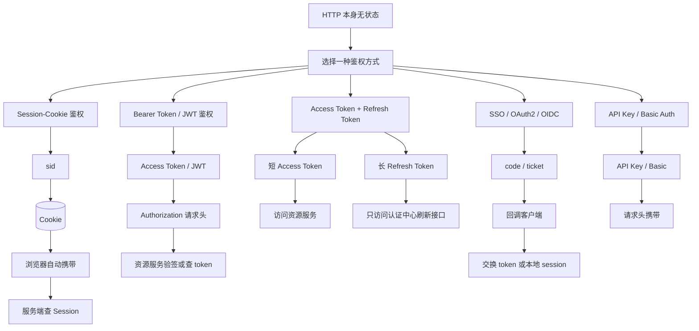
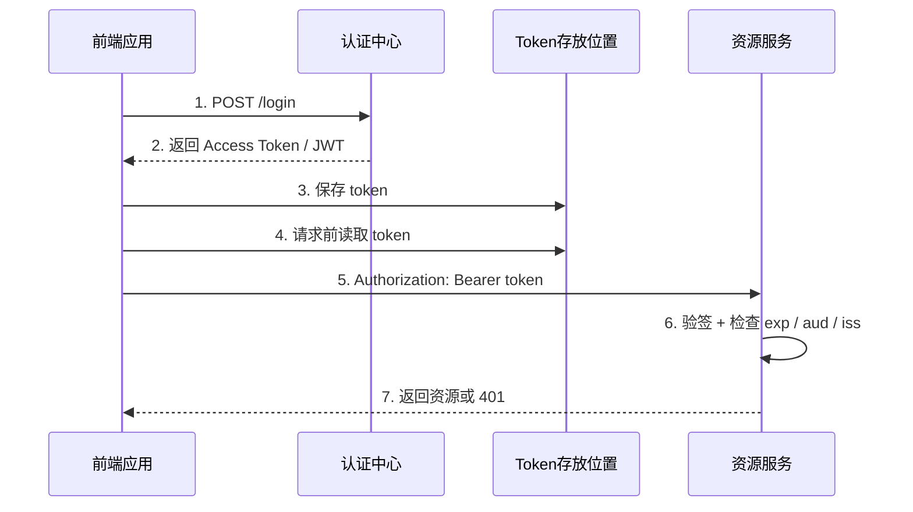
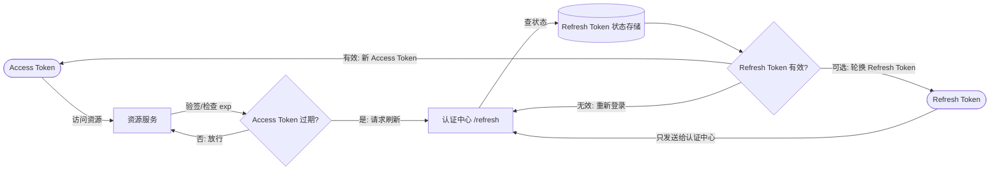
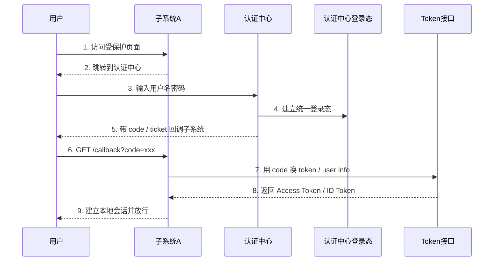
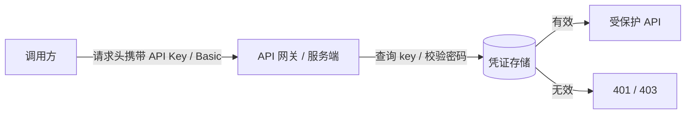
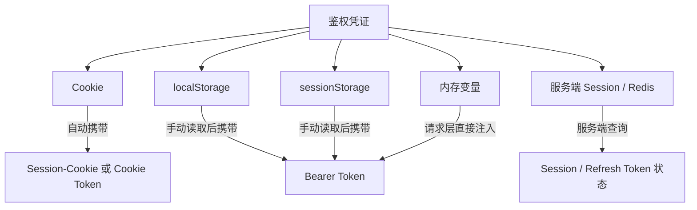
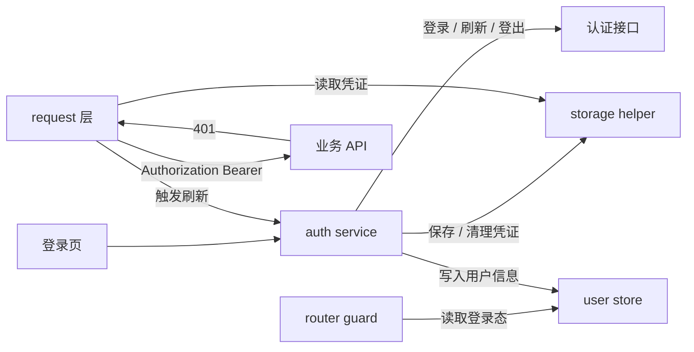

> 来源文档：`docs/codex1/cookie&&webStorage&&TOKNE.md`
>
> 目标：把 Cookie / WebStorage / Token / SSO 重新整理成适合生成 SVG 的“鉴权方式分类图谱”。
>
> 重新分类原则：鉴权方式是一级分类，Cookie、localStorage、sessionStorage 只是凭证存放或携带方式，不再放到一级分类。
>
> 参考资料：
> - https://zhuanlan.zhihu.com/p/677982758
> - [MDN：Using HTTP cookies](https://developer.mozilla.org/en-US/docs/Web/HTTP/Guides/Cookies)
> - [MDN：Web Storage API](https://developer.mozilla.org/en-US/docs/Web/API/Web_Storage_API)
> - [RFC 7519：JSON Web Token](https://datatracker.ietf.org/doc/html/rfc7519)
> - [RFC 6749：OAuth 2.0](https://datatracker.ietf.org/doc/html/rfc6749)

# Cookie / WebStorage / Token 鉴权方式 SVG 结构化图谱

## 0. 先定分类口径

### 一句话

鉴权方式回答的是：服务端如何判断“这个请求是谁发的、有没有资格访问资源”。

Cookie、localStorage、sessionStorage 回答的是：凭证放在哪里、请求时怎么带过去。

所以分类时不要写成：

```text
Cookie 鉴权
localStorage 鉴权
sessionStorage 鉴权
Token 鉴权
```

更清楚的分类应该是：

```text
Session-Cookie 鉴权
Bearer Token / JWT 鉴权
Access Token + Refresh Token 鉴权
SSO / OAuth2 / OIDC 鉴权
API Key / Basic Auth 鉴权
```

然后再问每种方式的凭证放在哪里：

```text
Cookie
HttpOnly Cookie
localStorage
sessionStorage
内存变量
服务端 Session / Redis / 数据库
```

### 本图谱的核心分层

| 层级 | 解决的问题 | 例子 |
|---|---|---|
| 鉴权方式 | 服务端靠什么认人、认权限 | Session、JWT、OAuth2、SSO |
| 凭证形态 | 被携带的东西长什么样 | sid、JWT、Access Token、Refresh Token、code、ticket、API Key |
| 凭证存放 | 凭证放在哪里 | Cookie、localStorage、sessionStorage、内存、服务端 Redis |
| 携带方式 | 请求时怎么发过去 | 自动携带 Cookie、`Authorization: Bearer`、URL code 回调、请求头 API Key |
| 验证位置 | 谁来验证凭证 | 认证中心、资源服务、本地中间件、网关 |

## 1. SVG 生成约定

### 推荐分组

| groupId | 分组名 | 适合放置位置 | 说明 |
|---|---|---:|---|
| G_CLIENT | 浏览器 / 前端应用 | 左侧 | 用户、Vue App、路由守卫、请求拦截器 |
| G_AUTH_CENTER | 认证中心 / 授权服务器 | 中上 | 登录、签发 sid/token/code、刷新 token |
| G_RESOURCE | 资源服务 / 子系统 | 右侧 | 子系统 A/B、后端 API、受保护资源 |
| G_SERVER_STATE | 服务端状态 | 中下 | Session 存储、Refresh Token 状态、授权码状态 |
| G_CLIENT_STORAGE | 客户端存放位置 | 左下 | Cookie、localStorage、sessionStorage、内存 |
| G_SECURITY | 风险与防护 | 下方 | XSS、CSRF、过期、吊销、SameSite、HttpOnly |
| G_METHOD | 鉴权方式分类 | 中间 | Session-Cookie、Bearer Token、双 Token、SSO/OAuth |

### 推荐节点形状

| type | SVG 形状 | 用途 |
|---|---|---|
| actor | 圆角矩形 | 用户、浏览器、Vue App |
| method | 大矩形 / 分组标题 | 一种鉴权方式 |
| storage | 圆柱体 | Cookie、localStorage、Session 存储、Redis |
| service | 矩形 | 认证中心、资源服务、网关 |
| api | 六边形 | `/login`、`/refresh`、`/resource`、`/callback` |
| decision | 菱形 | sid 是否有效、token 是否过期、code 是否已使用 |
| credential | 胶囊形 | sid、JWT、Access Token、Refresh Token、code |
| risk | 便签 | XSS、CSRF、吊销困难、泄露风险 |

### 连线标签规范

| edgeLabel | 含义 |
|---|---|
| 登录 | 提交用户名密码或跳转到认证中心 |
| 签发 | 认证中心生成凭证 |
| 写入 | 把凭证写到 Cookie / Storage / 服务端状态 |
| 自动携带 | 浏览器自动把 Cookie 放进请求 |
| 手动携带 | 前端代码把 token 放进请求头 |
| 交换 | 用 code / ticket 换 token 或本地 session |
| 验证 | 服务端校验 sid / token / code |
| 刷新 | 用 Refresh Token 换新 Access Token |
| 吊销 | 服务端使凭证失效 |
| 放行 | 验证通过后访问资源 |
| 拒绝 | 验证失败后要求重新登录 |

## 2. 鉴权方式总览

### 分类总表

| 鉴权方式 | 客户端凭证 | 服务端状态 | 请求携带方式 | 主要验证者 | 适合场景 | 主要风险 |
|---|---|---|---|---|---|---|
| Session-Cookie | sid Cookie | 有，Session / Redis 保存登录态 | 浏览器自动携带 Cookie | 认证中心或业务服务 | 传统 Web、同站点后台、服务端渲染 | CSRF、Session 固定、跨域 Cookie 配置复杂 |
| Bearer Token / JWT | Access Token 或 JWT | 可无状态，也可有黑名单 | `Authorization: Bearer <token>` | 资源服务 / 网关 | SPA、前后端分离、移动端 API | XSS 窃取、无状态 JWT 吊销困难 |
| Access Token + Refresh Token | 短 Access Token + 长 Refresh Token | Refresh Token 通常有状态 | Access 访问资源，Refresh 只找认证中心 | 资源服务 + 认证中心 | 需要短 token、自动续期、可控下线 | Refresh Token 泄露、刷新并发、轮换复杂 |
| SSO / OAuth2 / OIDC | code、ticket、Access Token、ID Token、本地会话 | 认证中心有登录态和授权记录 | 跳转回调 + token / session | 认证中心、客户端、资源服务 | 多系统单点登录、第三方登录、统一身份平台 | redirect_uri 配置、code 泄露、token 作用域过大 |
| API Key / Basic Auth | API Key 或用户名密码 | 可有，也可直接查数据库 | 请求头手动携带 | API 网关 / 业务服务 | 服务间调用、简单开放 API、调试 | 凭证长期有效、细粒度权限弱、不适合浏览器用户登录 |

### 总览 Mermaid 草图



### 这张总览图的画法

| 画图重点 | 说明 |
|---|---|
| 一级颜色按“鉴权方式”分 | 不要按 Cookie / localStorage 分颜色 |
| Cookie / localStorage 画成底部存放层 | 它们是落点，不是主分类 |
| Session 和 Refresh Token 状态画到服务端状态层 | 这两个最能体现“服务端可控” |
| JWT / Access Token 画成胶囊 | 表示请求携带的凭证 |
| SSO 单独画成跳转流程 | SSO 的重点是跨系统跳转和统一登录态 |

## 3. Session-Cookie 鉴权

### 核心判断

Session-Cookie 的本质是：服务端保存登录状态，浏览器只保存一个 session id。

用户登录成功后，服务端生成 `sid`，把 `sid -> user` 写进 Session 存储，再通过 `Set-Cookie` 把 sid 写给浏览器。后续请求里，浏览器会自动把 Cookie 带上，服务端根据 sid 查 Session。

### 状态归属

| 状态 / 凭证 | 真实持有者 | 是否有状态 | 写入者 | 读取者 | 说明 |
|---|---|---|---|---|---|
| 用户名 / 密码 | 用户输入 | 不长期保存 | 用户 | 登录接口 | 只用于登录校验 |
| sid Cookie | 浏览器 Cookie | 客户端只保存 id | 服务端 `Set-Cookie` | 浏览器自动携带，服务端读取 | 请求身份索引 |
| Session 数据 | 服务端 / Redis / 内存 | 有状态 | 登录接口 | 认证中间件 / 认证中心 | 真实登录态 |
| 用户权限 | 服务端数据库 / 权限服务 | 有状态 | 后台配置 | 资源服务 | 决定能访问什么 |

### 节点清单

| id | label | groupId | type |
|---|---|---|---|
| U | 用户 | G_CLIENT | actor |
| BR | 浏览器 | G_CLIENT | actor |
| LOGIN | `/login` 登录接口 | G_AUTH_CENTER | api |
| SID | sid | G_CLIENT | credential |
| COOKIE_SID | Cookie: sid | G_CLIENT_STORAGE | storage |
| SESSION_STORE | Session 存储 `sid -> user` | G_SERVER_STATE | storage |
| AUTH_MIDDLEWARE | Session 认证中间件 | G_RESOURCE | service |
| RESOURCE | 受保护资源 | G_RESOURCE | api |
| CSRF | CSRF 风险 | G_SECURITY | risk |
| COOKIE_FLAGS | `HttpOnly` / `Secure` / `SameSite` | G_SECURITY | risk |

### 连线清单

| order | from | to | label | 说明 |
|---:|---|---|---|---|
| 1 | U | LOGIN | 登录 | 提交用户名密码 |
| 2 | LOGIN | SESSION_STORE | 写入 | 生成 `sid -> user` |
| 3 | LOGIN | COOKIE_SID | Set-Cookie | 把 sid 写入浏览器 Cookie |
| 4 | BR | RESOURCE | 自动携带 | 请求资源时 Cookie 自动进入请求头 |
| 5 | RESOURCE | AUTH_MIDDLEWARE | 验证 | 业务服务读取 sid |
| 6 | AUTH_MIDDLEWARE | SESSION_STORE | 查询 | 查 sid 是否存在、是否过期 |
| 7 | SESSION_STORE | RESOURCE | 放行 / 拒绝 | Session 有效则放行 |
| 8 | COOKIE_SID | CSRF | 风险 | Cookie 自动携带会带来 CSRF 面 |
| 9 | COOKIE_FLAGS | COOKIE_SID | 防护 | 用 HttpOnly、Secure、SameSite 降低风险 |

### Mermaid 草图

```mermaid
sequenceDiagram
  participant U as 用户
  participant Br as 浏览器
  participant Auth as 登录接口
  participant Store as Session存储
  participant Api as 资源服务

  U->>Auth: 1. 提交用户名密码
  Auth->>Store: 2. 写入 sid -> user
  Auth-->>Br: 3. Set-Cookie: sid; HttpOnly; SameSite
  Br->>Api: 4. 请求资源，浏览器自动携带 Cookie
  Api->>Store: 5. 查询 sid 是否有效
  Store-->>Api: 6. 返回 user / 过期 / 不存在
  Api-->>Br: 7. 放行资源或返回 401
```

### 适合画在图上的结论

| 结论 | 画图表达 |
|---|---|
| Cookie 不是鉴权方式本身 | Cookie 画在客户端存放层 |
| Session 才是这类方式的核心 | Session 存储画成粗边框 |
| 自动携带是 Cookie 的关键特征 | 浏览器到资源服务的边标“自动携带” |
| 服务端可主动失效 | Session 存储到 sid 的边标“删除 / 过期 / 吊销” |
| 主要防 CSRF | Cookie 节点旁边放 `SameSite`、CSRF 便签 |

## 4. Bearer Token / JWT 鉴权

### 核心判断

Bearer Token 的本质是：谁拿着 token，谁就能访问资源。

JWT 是一种常见 token 格式，它把用户 id、过期时间、签发者、受众等声明放进 token，并通过签名防篡改。资源服务可以本地验签，不一定每次都查认证中心。

### 状态归属

| 状态 / 凭证 | 真实持有者 | 是否有状态 | 写入者 | 读取者 | 说明 |
|---|---|---|---|---|---|
| Access Token | 浏览器 / App | 通常无状态 | 认证中心 | 请求拦截器、资源服务 | 访问资源的凭证 |
| JWT payload | token 内部 | 随 token 自包含 | 认证中心 | 资源服务验签后读取 | 常见有 `sub`、`exp`、`iss`、`aud` |
| 签名密钥 / 公钥 | 服务端 | 服务端配置 | 运维 / 认证中心 | 认证中心签名，资源服务验签 | 不能暴露给前端 |
| token 黑名单 | 服务端 / Redis | 可选有状态 | 登出 / 风控 | 资源服务 / 网关 | 用来弥补 JWT 吊销困难 |

### 凭证存放选择

| 存放位置 | 是否自动携带 | JS 能否读取 | 生命周期 | 风险重点 | 适合画法 |
|---|---|---|---|---|---|
| 内存变量 | 否 | 能 | 刷新页面丢失 | 用户体验弱，但泄露面较小 | 画成 Vue App 内部节点 |
| sessionStorage | 否 | 能 | 关闭标签页丢失 | XSS 可读 | 画成标签页级存储 |
| localStorage | 否 | 能 | 持久化 | XSS 可读，泄露后时间长 | 画成持久化存储，标风险 |
| HttpOnly Cookie | 是 | 不能 | 由 Cookie 属性控制 | CSRF、跨域 Cookie 策略 | 画成 Cookie 存储，但鉴权仍是 token |

### 节点清单

| id | label | groupId | type |
|---|---|---|---|
| FE_LOGIN | 前端登录动作 | G_CLIENT | api |
| AUTH_LOGIN | 认证中心 `/login` | G_AUTH_CENTER | api |
| JWT | JWT / Access Token | G_CLIENT | credential |
| MEMORY_TOKEN | 内存 token | G_CLIENT_STORAGE | storage |
| LOCAL_TOKEN | localStorage: token | G_CLIENT_STORAGE | storage |
| SESSION_TOKEN | sessionStorage: token | G_CLIENT_STORAGE | storage |
| API_CLIENT | axios / fetch 请求层 | G_CLIENT | service |
| RESOURCE_API | 资源服务 API | G_RESOURCE | api |
| JWT_VERIFY | 本地验签 / introspection | G_RESOURCE | service |
| XSS | XSS 窃取风险 | G_SECURITY | risk |
| REVOCATION | 吊销困难 | G_SECURITY | risk |

### 连线清单

| order | from | to | label | 说明 |
|---:|---|---|---|---|
| 1 | FE_LOGIN | AUTH_LOGIN | 登录 | 提交用户名密码 |
| 2 | AUTH_LOGIN | JWT | 签发 | 返回 Access Token 或 JWT |
| 3 | JWT | LOCAL_TOKEN | 可选写入 | 持久化保存，XSS 风险高 |
| 4 | JWT | SESSION_TOKEN | 可选写入 | 标签页级保存 |
| 5 | JWT | MEMORY_TOKEN | 可选写入 | 刷新丢失，但暴露时间短 |
| 6 | API_CLIENT | LOCAL_TOKEN | 读取 | 请求前取 token |
| 7 | API_CLIENT | RESOURCE_API | 手动携带 | `Authorization: Bearer <token>` |
| 8 | RESOURCE_API | JWT_VERIFY | 验证 | 验签、检查 `exp`、`aud`、`iss` |
| 9 | JWT_VERIFY | RESOURCE_API | 放行 / 拒绝 | token 有效则访问资源 |
| 10 | LOCAL_TOKEN | XSS | 风险 | JS 可读存储被 XSS 命中会泄露 |
| 11 | JWT | REVOCATION | 风险 | 纯无状态 JWT 在过期前不易主动失效 |

### Mermaid 草图



### 适合画在图上的结论

| 结论 | 画图表达 |
|---|---|
| Token 鉴权核心是“手动携带” | 请求层到资源服务的边标 `Authorization: Bearer` |
| JWT 可本地验签 | 资源服务内部画一个 `jwt.verify` 节点 |
| 存 localStorage 不是“localStorage 鉴权” | localStorage 只画成 token 落点 |
| XSS 是主要风险 | localStorage / sessionStorage 旁边放 XSS 便签 |
| 纯 JWT 主动吊销弱 | JWT 节点旁放“短有效期 / 黑名单 / 版本号” |

## 5. Access Token + Refresh Token 鉴权

### 核心判断

双 Token 的本质是：短 token 访问资源，长 token 负责续命。

Access Token 生命周期短，资源服务高频验证它。Refresh Token 生命周期长，只应该发给认证中心，用来换新的 Access Token。这样既能减少 Access Token 泄露后的有效窗口，又能通过服务端 Refresh Token 状态实现吊销、轮换、强制下线。

### 状态归属

| 状态 / 凭证 | 真实持有者 | 是否有状态 | 用途 | 发送给谁 |
|---|---|---|---|---|
| Access Token | 客户端 | 通常无状态 | 高频访问资源 | 资源服务 |
| Refresh Token | 客户端 | 通常服务端有状态 | 换新 Access Token | 认证中心 |
| Refresh Token 状态 | 认证中心数据库 / Redis | 有状态 | 记录归属、过期、吊销、是否轮换 | 认证中心内部 |
| 登录态 UI | 前端 store | 前端状态 | 判断是否展示已登录界面 | 前端组件 |

### 节点清单

| id | label | groupId | type |
|---|---|---|---|
| ACCESS_TOKEN | Access Token | G_CLIENT | credential |
| REFRESH_TOKEN | Refresh Token | G_CLIENT | credential |
| ACCESS_STORAGE | Access Token 存放位置 | G_CLIENT_STORAGE | storage |
| REFRESH_STORAGE | Refresh Token 存放位置 | G_CLIENT_STORAGE | storage |
| RESOURCE_SERVICE | 资源服务 | G_RESOURCE | service |
| AUTH_REFRESH | 认证中心 `/refresh` | G_AUTH_CENTER | api |
| REFRESH_STORE | Refresh Token 状态存储 | G_SERVER_STATE | storage |
| ACCESS_EXPIRED | Access Token 是否过期 | G_SECURITY | decision |
| REFRESH_VALID | Refresh Token 是否有效 | G_SECURITY | decision |
| ROTATION | Refresh Token 轮换 | G_SECURITY | risk |

### 连线清单

| order | from | to | label | 说明 |
|---:|---|---|---|---|
| 1 | ACCESS_TOKEN | RESOURCE_SERVICE | 手动携带 | 用短 token 访问资源 |
| 2 | RESOURCE_SERVICE | ACCESS_EXPIRED | 验证 | 判断是否过期 |
| 3 | ACCESS_EXPIRED | RESOURCE_SERVICE | 放行 | 未过期则返回资源 |
| 4 | ACCESS_EXPIRED | AUTH_REFRESH | 刷新 | 过期后前端请求刷新 |
| 5 | REFRESH_TOKEN | AUTH_REFRESH | 手动携带 | Refresh Token 只给认证中心 |
| 6 | AUTH_REFRESH | REFRESH_STORE | 验证 | 检查是否存在、过期、吊销、已轮换 |
| 7 | REFRESH_STORE | REFRESH_VALID | 返回状态 | 判断能否续期 |
| 8 | REFRESH_VALID | ACCESS_TOKEN | 签发 | 有效则返回新 Access Token |
| 9 | REFRESH_VALID | REFRESH_TOKEN | 轮换 | 可选返回新 Refresh Token |
| 10 | REFRESH_VALID | RESOURCE_SERVICE | 拒绝 | 无效则要求重新登录 |

### Mermaid 草图



### 适合画在图上的结论

| 结论 | 画图表达 |
|---|---|
| Access Token 和 Refresh Token 必须分路 | Access 去资源服务，Refresh 去认证中心 |
| Refresh Token 是控制点 | Refresh 状态存储用粗边框 |
| Access Token 泄露靠短过期降低伤害 | Access 节点旁标“短有效期” |
| 强制下线靠拒绝 refresh | Refresh Store 到 `/refresh` 的边标“吊销 / 过期 / 已使用” |
| 刷新并发需要处理 | Refresh 节点旁标“排队刷新 / 单飞请求” |

## 6. SSO / OAuth2 / OIDC 鉴权

### 核心判断

SSO 不是单纯“把一个 token 复制给所有系统”。它更像一种登录架构：用户只在认证中心登录一次，子系统通过跳转、code / ticket 交换，确认用户身份，然后建立自己的登录态或拿到访问资源的 token。

OAuth2 重点是授权，OIDC 在 OAuth2 之上补充身份认证。前端常见理解可以先拆成三件事：

| 名词 | 作用 | 不要混淆 |
|---|---|---|
| Authorization Code / ticket | 临时票据，用来换 token 或本地会话 | 不是长期登录凭证 |
| Access Token | 访问资源 API | 不是“用户资料证明”本身 |
| ID Token | 证明用户身份，OIDC 场景常见 | 不应该直接当 API 访问凭证 |

### 状态归属

| 状态 / 凭证 | 真实持有者 | 是否有状态 | 用途 |
|---|---|---|---|
| 认证中心登录态 | 认证中心 Session / Cookie | 有状态 | 判断用户是否已经在统一登录中心登录 |
| Authorization Code / ticket | 浏览器短暂携带，认证中心记录 | 有状态，短期一次性 | 子系统用它换 token / 本地 session |
| Access Token | 客户端或后端服务 | 视实现而定 | 访问资源 API |
| ID Token | 客户端 | JWT 形式常见 | 证明“用户是谁” |
| 子系统本地 session | 子系统服务端 | 有状态 | 子系统自己的登录态 |

### 节点清单

| id | label | groupId | type |
|---|---|---|---|
| USER | 用户 | G_CLIENT | actor |
| APP_A | 子系统 A | G_RESOURCE | service |
| APP_B | 子系统 B | G_RESOURCE | service |
| AUTH_SERVER | 统一认证中心 | G_AUTH_CENTER | service |
| AUTH_LOGIN_PAGE | 认证中心登录页 | G_AUTH_CENTER | api |
| AUTH_SESSION | 认证中心登录态 | G_SERVER_STATE | storage |
| CODE | Authorization Code / ticket | G_CLIENT | credential |
| CALLBACK | 子系统回调地址 `/callback` | G_RESOURCE | api |
| TOKEN_ENDPOINT | 认证中心 `/token` | G_AUTH_CENTER | api |
| APP_SESSION | 子系统本地 session | G_SERVER_STATE | storage |
| ACCESS_TOKEN_SSO | Access Token | G_CLIENT | credential |
| ID_TOKEN | ID Token | G_CLIENT | credential |

### 连线清单

| order | from | to | label | 说明 |
|---:|---|---|---|---|
| 1 | USER | APP_A | 访问 | 访问子系统 A |
| 2 | APP_A | AUTH_SERVER | 跳转登录 | 未登录则跳到认证中心 |
| 3 | AUTH_SERVER | AUTH_LOGIN_PAGE | 登录 | 用户在认证中心登录 |
| 4 | AUTH_LOGIN_PAGE | AUTH_SESSION | 写入 | 认证中心建立统一登录态 |
| 5 | AUTH_SERVER | CODE | 签发 | 生成短期 code / ticket |
| 6 | CODE | CALLBACK | 回调 | 带着 code 回到子系统 |
| 7 | CALLBACK | TOKEN_ENDPOINT | 交换 | 子系统用 code 换 token / user info |
| 8 | TOKEN_ENDPOINT | APP_SESSION | 写入 | 子系统可建立自己的本地 session |
| 9 | TOKEN_ENDPOINT | ACCESS_TOKEN_SSO | 签发 | 返回访问资源的 token |
| 10 | TOKEN_ENDPOINT | ID_TOKEN | 签发 | OIDC 场景返回身份 token |
| 11 | USER | APP_B | 访问 | 再访问子系统 B |
| 12 | APP_B | AUTH_SERVER | 检查登录态 | 认证中心已有登录态，无需用户再输入密码 |

### Mermaid 草图



### 适合画在图上的结论

| 结论 | 画图表达 |
|---|---|
| SSO 的核心是统一登录态 | 认证中心 Session 画成核心粗节点 |
| code / ticket 是短期一次性票据 | code 节点标“短期、一次性、用于交换” |
| 子系统可以落成本地 session 或 token | 回调后分两条边：写本地 session / 签发 token |
| Access Token 和 ID Token 作用不同 | 两个 token 分开画 |
| 多系统复用登录态，不是复用密码 | 子系统 B 回到认证中心时标“已有登录态” |

## 7. API Key / Basic Auth 鉴权

### 核心判断

API Key 和 Basic Auth 更适合画成补充分类。它们是“请求里直接带固定凭证”的方式，简单，但不适合当现代浏览器用户登录的主方案。

### 对比表

| 方式 | 凭证 | 携带方式 | 适合场景 | 不适合 |
|---|---|---|---|---|
| API Key | 一串 key | `X-API-Key` 或 query 参数 | 服务间调用、开放 API、脚本调用 | 普通用户登录、强权限隔离 |
| Basic Auth | 用户名密码 Base64 | `Authorization: Basic ...` | 内部工具、临时保护、调试 | 长期 Web 登录、复杂权限 |

### Mermaid 草图



## 8. 凭证存放方式：作为第二层分类

### 存放方式对比

| 存放方式 | 属于鉴权方式吗 | 自动发请求吗 | JS 可读吗 | 适合承载 | 主要风险 |
|---|---|---|---|---|---|
| Cookie | 否，是存放和携带机制 | 是 | 普通 Cookie 可读，HttpOnly 不可读 | sid、token | CSRF、跨域 Cookie 策略、容量小 |
| localStorage | 否，是浏览器存储 | 否 | 可读 | token、非敏感缓存 | XSS 窃取、持久化时间长 |
| sessionStorage | 否，是浏览器存储 | 否 | 可读 | 临时 token、页面会话状态 | XSS 窃取、刷新/多标签体验 |
| 内存变量 | 否，是运行时状态 | 否 | 代码可访问 | 短期 token | 刷新丢失、需要静默恢复 |
| 服务端 Session / Redis | 否，是服务端状态存储 | 不适用 | 前端不可读 | `sid -> user`、Refresh Token 状态 | 服务端扩展、过期策略、同步问题 |

### 存放选择 Mermaid 草图



## 9. Vue 前端项目落地位置

### 模块职责拆分

| 模块 | 应该负责 | 不应该负责 |
|---|---|---|
| 登录页 | 收集账号密码、触发登录、处理登录结果 | 直接散落保存 token 的细节 |
| auth service | 调 `/login`、`/refresh`、`/logout`，封装 token 保存与清理 | 处理复杂 UI 展示 |
| request 层 | 注入 `Authorization`、处理 401、排队刷新 token | 直接决定页面显示什么 |
| router guard | 判断是否需要登录、跳转登录页、保留 redirect | 亲自调用一堆业务接口 |
| store | 保存用户信息、权限、前端登录态 | 把 token 长期暴露给所有组件随便读写 |
| storage helper | 统一读写 Cookie / localStorage / sessionStorage | 写业务判断 |

### Vue 鉴权流 Mermaid 草图



## 10. 适合生成 SVG 的总节点索引

| id | label | groupId | type | 推荐颜色 |
|---|---|---|---|---|
| SESSION_METHOD | Session-Cookie 鉴权 | G_METHOD | method | `#2563eb` |
| BEARER_METHOD | Bearer Token / JWT 鉴权 | G_METHOD | method | `#dc2626` |
| DOUBLE_METHOD | Access Token + Refresh Token | G_METHOD | method | `#ea580c` |
| SSO_METHOD | SSO / OAuth2 / OIDC | G_METHOD | method | `#7c3aed` |
| API_KEY_METHOD | API Key / Basic Auth | G_METHOD | method | `#64748b` |
| BR | 浏览器 / 前端应用 | G_CLIENT | actor | `#0f766e` |
| API_CLIENT | axios / fetch 请求层 | G_CLIENT | service | `#0f766e` |
| AUTH_SERVER | 认证中心 | G_AUTH_CENTER | service | `#7c3aed` |
| RESOURCE_SERVICE | 资源服务 | G_RESOURCE | service | `#0891b2` |
| COOKIE_SID | Cookie: sid | G_CLIENT_STORAGE | storage | `#16a34a` |
| LOCAL_TOKEN | localStorage: token | G_CLIENT_STORAGE | storage | `#16a34a` |
| SESSION_TOKEN | sessionStorage: token | G_CLIENT_STORAGE | storage | `#16a34a` |
| MEMORY_TOKEN | 内存 token | G_CLIENT_STORAGE | storage | `#16a34a` |
| SESSION_STORE | Session 存储 | G_SERVER_STATE | storage | `#ca8a04` |
| REFRESH_STORE | Refresh Token 状态存储 | G_SERVER_STATE | storage | `#ca8a04` |
| SID | sid | G_CLIENT | credential | `#2563eb` |
| JWT | JWT / Access Token | G_CLIENT | credential | `#dc2626` |
| ACCESS_TOKEN | Access Token | G_CLIENT | credential | `#dc2626` |
| REFRESH_TOKEN | Refresh Token | G_CLIENT | credential | `#ea580c` |
| CODE | Authorization Code / ticket | G_CLIENT | credential | `#7c3aed` |
| ID_TOKEN | ID Token | G_CLIENT | credential | `#7c3aed` |
| CSRF | CSRF 风险 | G_SECURITY | risk | `#be123c` |
| XSS | XSS 风险 | G_SECURITY | risk | `#be123c` |
| REVOCATION | 吊销困难 | G_SECURITY | risk | `#be123c` |

## 11. 适合生成 SVG 的总连线索引

| from | to | label | diagram |
|---|---|---|---|
| SESSION_METHOD | SID | 使用 sid | 总览图 |
| SID | COOKIE_SID | 写入 Cookie | Session-Cookie |
| COOKIE_SID | RESOURCE_SERVICE | 自动携带 | Session-Cookie |
| RESOURCE_SERVICE | SESSION_STORE | 查询 Session | Session-Cookie |
| BEARER_METHOD | JWT | 签发 token | Bearer Token / JWT |
| JWT | LOCAL_TOKEN | 可选保存 | Bearer Token / JWT |
| JWT | SESSION_TOKEN | 可选保存 | Bearer Token / JWT |
| JWT | MEMORY_TOKEN | 可选保存 | Bearer Token / JWT |
| API_CLIENT | RESOURCE_SERVICE | Authorization Bearer | Bearer Token / JWT |
| RESOURCE_SERVICE | JWT | 验签 / 校验过期 | Bearer Token / JWT |
| DOUBLE_METHOD | ACCESS_TOKEN | 短期访问凭证 | 双 Token |
| DOUBLE_METHOD | REFRESH_TOKEN | 长期刷新凭证 | 双 Token |
| ACCESS_TOKEN | RESOURCE_SERVICE | 访问资源 | 双 Token |
| REFRESH_TOKEN | AUTH_SERVER | 刷新 Access Token | 双 Token |
| AUTH_SERVER | REFRESH_STORE | 校验 refresh 状态 | 双 Token |
| SSO_METHOD | AUTH_SERVER | 跳转登录 | SSO |
| AUTH_SERVER | CODE | 签发 code / ticket | SSO |
| CODE | RESOURCE_SERVICE | 回调子系统 | SSO |
| RESOURCE_SERVICE | AUTH_SERVER | code 交换 | SSO |
| AUTH_SERVER | ACCESS_TOKEN | 签发 Access Token | SSO / OAuth |
| AUTH_SERVER | ID_TOKEN | 签发 ID Token | OIDC |
| API_KEY_METHOD | RESOURCE_SERVICE | 请求头带 key | API Key / Basic |
| COOKIE_SID | CSRF | 自动携带带来 CSRF 面 | 风险图 |
| LOCAL_TOKEN | XSS | JS 可读带来 XSS 泄露面 | 风险图 |
| JWT | REVOCATION | 无状态 token 吊销困难 | 风险图 |

## 12. SVG 绘制建议

1. 第一张总览图按“鉴权方式”分五块：Session-Cookie、Bearer Token / JWT、双 Token、SSO / OAuth2 / OIDC、API Key / Basic。
2. 每种鉴权方式内部再画“凭证是什么、放在哪里、怎么携带、谁验证”四个小节点。
3. Cookie、localStorage、sessionStorage 只放在底部“客户端存放位置”分组，不要当成一级鉴权方式。
4. Session 存储、Refresh Token 状态、认证中心登录态都画到“服务端状态”分组，并用粗边框强调它们是真正的控制点。
5. Bearer Token / JWT 图里重点标“手动携带 Authorization”，Session-Cookie 图里重点标“浏览器自动携带 Cookie”。
6. 双 Token 图里必须分清：Access Token 只访问资源服务，Refresh Token 只访问认证中心。
7. SSO 图里重点画“跳转到认证中心 -> 回调 code / ticket -> 交换 token 或本地 session”，不要画成多个子系统共享同一个密码。
8. 风险图可以单独成一张：Cookie 旁标 CSRF，localStorage/sessionStorage 旁标 XSS，JWT 旁标吊销困难，Refresh Token 旁标泄露和轮换。

## 13. 最终记忆版

```text
Session-Cookie：
服务端记登录态，浏览器只拿 sid，Cookie 自动携带。

Bearer Token / JWT：
客户端拿 token，前端手动放 Authorization，资源服务验 token。

Access Token + Refresh Token：
短 token 访问资源，长 token 找认证中心续期，Refresh 是控制点。

SSO / OAuth2 / OIDC：
统一认证中心负责登录，子系统通过 code / ticket / token 建立自己的访问能力。

Cookie / localStorage / sessionStorage：
它们不是鉴权方式，只是凭证存放和携带位置。
```
