这份文档把 `npm run build`、`dist`、域名、DNS、CDN、Nginx、浏览器渲染、后端 API、反向代理、HTTP/TCP/IP 串成一条完整链路。

它的目标不是只做文字笔记，而是作为 SVG 流程图的源文档使用。每个流程都包含：

- 可转 SVG 的 Mermaid 流程图
- 流程下方解释
- 节点清单
- 连线清单

后续如果要生成 SVG，可以先把 Mermaid 图导出为 SVG，也可以根据“节点清单 + 连线清单”手写 SVG。

## 1. 一句话总览

```text
源码通过 npm run build 生成 dist；
流水线把 dist 部署到 Nginx 源站或 CDN；
用户通过域名访问；
DNS 把域名解析到 CDN 或 Nginx 的 IP；
浏览器基于 TCP/IP + HTTPS + HTTP 请求资源；
CDN 或 Nginx 返回 HTML/CSS/JS；
浏览器解析、执行、渲染 Vue 页面；
页面里的 JS 再发 /api 请求；
Nginx 把 /api 反向代理到后端 API 服务器；
后端返回 JSON；
浏览器更新页面。
```

## 2. 总流程图

```mermaid
flowchart LR
  A["开发者提交源码"] --> B["流水线 CI/CD"]
  B --> C["安装依赖 npm install"]
  C --> D["构建 npm run build"]
  D --> E["Vite/Rollup/Webpack/esbuild 处理源码"]
  E --> F["生成 dist 静态文件"]
  F --> G["部署到 Nginx 源站或 CDN"]
  G --> H["用户在浏览器输入域名"]
  H --> I["DNS 解析域名为 IP"]
  I --> J{"是否接入 CDN"}
  J -- "是" --> K["连接最近 CDN 节点"]
  J -- "否" --> L["连接源站 Nginx"]
  K --> M{"CDN 是否命中缓存"}
  M -- "命中" --> N["CDN 返回 HTML/CSS/JS/图片"]
  M -- "未命中" --> O["CDN 回源到 Nginx 拉取 dist"]
  O --> N
  L --> P["Nginx 从 dist 返回静态资源"]
  N --> Q["浏览器解析 HTML/CSS/JS"]
  P --> Q
  Q --> R["Vue 应用挂载并渲染页面"]
  R --> S["前端 JS 发送 /api 请求"]
  S --> T["Nginx 反向代理 /api"]
  T --> U["后端 API 服务器处理业务"]
  U --> V["返回 JSON"]
  V --> W["浏览器接收数据并更新页面"]
```

### 总流程解释

这个图把“构建阶段”和“运行阶段”连在了一起。

`npm run build` 属于上线前的构建动作，它负责把源码变成 `dist`。Nginx 和 CDN 不负责打包，它们只负责在用户访问时把 `dist` 里的文件返回给浏览器。

浏览器访问域名时，先经过 DNS 找到目标 IP。目标 IP 可能是 CDN 节点，也可能是源站 Nginx。拿到 HTML、CSS、JS 后，浏览器开始解析和渲染页面。页面渲染出来以后，前端 JS 才会继续发送 `/api` 请求获取业务数据。

`/api` 请求通常不会直接打到前端静态资源目录，而是由 Nginx 反向代理给真正的后端 API 服务器。

## 3. 构建阶段流程

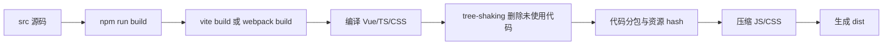

### 构建阶段解释

构建阶段发生在用户访问网站之前，通常发生在本地机器或流水线服务器上。

`npm run build` 本身只是执行 `package.json` 里的脚本。Vue3 + Vite 项目里，它背后通常是：

```bash
vite build
```

构建工具会处理这些事情：

- 把 `.vue` 单文件组件编译成浏览器可执行的 JavaScript。
- 把 TypeScript 转成 JavaScript。
- 把 Sass/Less/PostCSS 等样式处理成 CSS。
- 使用 tree-shaking 删除没有被实际引用的代码。
- 把代码拆成多个 chunk，避免所有代码都塞进一个大文件。
- 给文件名加 hash，例如 `index-a1b2c3.js`，方便长期缓存。
- 压缩 JS 和 CSS，减少网络传输体积。
- 最后输出 `dist`。

这里要分清楚：

```text
Vite / Rollup / Webpack / esbuild 决定 dist 怎么生成。
Nginx / CDN 决定 dist 怎么被访问。
```

## 4. dist 文件的角色

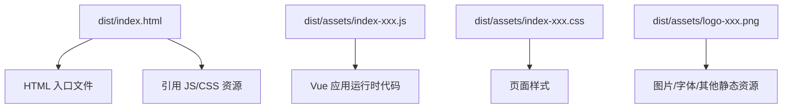

### dist 解释

`dist` 是构建产物，不是源码目录。

典型结构如下：

```text
dist/
  index.html
  assets/index-a1b2c3.js
  assets/index-d4e5f6.css
  assets/logo-xxxx.png
```

`index.html` 是浏览器最先拿到的入口文件。它通常只有一个挂载点和若干资源引用：

```html
<div id="app"></div>
<script type="module" src="/assets/index-a1b2c3.js"></script>
```

真正的 Vue 页面逻辑在 JS 文件里。浏览器拿到 `index.html` 后，会继续请求 JS、CSS、图片等文件。

Nginx 管的不是“怎么生成 dist”，而是：

- 用户请求 `/index.html` 时，返回哪个文件。
- 用户请求 `/assets/index-a1b2c3.js` 时，返回哪个 JS。
- 用户刷新 `/home` 时，是否回退到 `index.html`。
- 静态资源是否开启缓存、gzip、brotli。

## 5. 部署阶段：流水线、源站、CDN

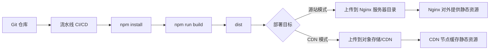

### 部署阶段解释

流水线不是服务器，它是一套自动化过程。

它通常做这些事：

```text
拉代码 -> 安装依赖 -> 检查代码 -> npm run build -> 生成 dist -> 上传 dist -> 刷新缓存/重启服务
```

部署目标一般有两类：

- 部署到 Nginx 源站服务器：`dist` 被放到服务器硬盘目录，例如 `/var/www/web-example`。
- 部署到 CDN 或对象存储：`dist` 被上传到云厂商的静态资源服务，由 CDN 节点对外返回资源。

源站可以理解为“原始文件所在地”。CDN 可以理解为“分布在各地的缓存服务器”。

## 6. 域名、DNS、IP、服务器

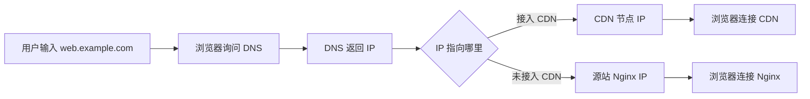

### 域名解析解释

域名不是服务器。域名只是一个方便人记忆的名字。

```text
web.example.com
```

DNS 的作用是把域名翻译成 IP：

```text
web.example.com -> 1.2.3.4
```

这个 IP 背后才是服务器或 CDN 节点。

如果没有 CDN：

```text
浏览器 -> DNS -> 源站 Nginx IP -> Nginx 返回 dist
```

如果有 CDN：

```text
浏览器 -> DNS -> 最近的 CDN 节点 IP -> CDN 返回缓存资源
```

所以 CDN 不会改变“浏览器要通过 IP 找服务器”这件事。它只是让 DNS 返回一个更近的 CDN 节点 IP。

## 7. CDN 缓存与回源流程

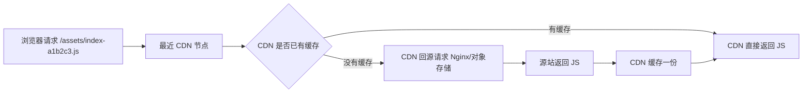

### CDN 解释

CDN 是 Content Delivery Network，内容分发网络。

你可以把它理解成：

```text
源站 Nginx = 总仓库
CDN 节点 = 各地前置仓
用户 = 来取资源的人
```

没有 CDN 时，所有用户都去源站拿资源。源站在北京，广州用户也要连到北京。

有 CDN 时，广州用户可能连接广州附近的 CDN 节点。如果这个节点已经缓存了 JS、CSS、图片，就直接返回给浏览器，不需要再访问源站 Nginx。

如果 CDN 节点没有缓存，它会“回源”：

```text
CDN 节点 -> 源站 Nginx/对象存储 -> 拉取资源 -> 缓存 -> 返回给浏览器
```

CDN 主要适合缓存静态资源：

- JS
- CSS
- 图片
- 字体
- 视频
- 带 hash 的构建产物

API 请求是否走 CDN 要看架构设计。多数普通后台接口还是由 Nginx 转发到后端 API 服务器。

## 8. 首屏静态资源请求流程

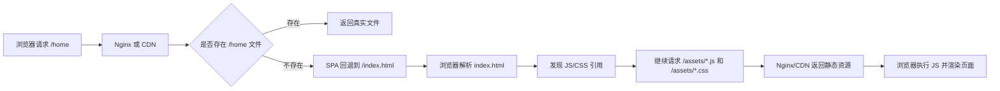

### 首屏请求解释

Vue Router 使用 history 模式时，用户可能直接访问：

```text
https://web.example.com/home
```

但服务器硬盘上通常没有一个真实的 `/home` 文件。真正存在的是：

```text
dist/index.html
```

所以 Nginx 需要配置：

```nginx
location / {
  try_files $uri $uri/ /index.html;
}
```

这句话的意思是：

```text
先找真实文件；
找不到真实文件；
就返回 index.html；
再让浏览器里的 Vue Router 识别 /home。
```

这样刷新前端路由时不会 404。

## 9. 浏览器渲染流程

```mermaid
flowchart LR
  A["接收 index.html"] --> B["解析 HTML 生成 DOM"]
  B --> C["请求并解析 CSS 生成 CSSOM"]
  C --> D["请求并执行 JS"]
  D --> E["Vue createApp"]
  E --> F["挂载到 #app"]
  F --> G["Vue Router 匹配当前路径"]
  G --> H["组件渲染为 DOM"]
  H --> I["DOM + CSSOM 生成渲染树"]
  I --> J["Layout 计算布局"]
  J --> K["Paint 绘制"]
  K --> L["Composite 合成显示"]
```

### 浏览器渲染解释

浏览器拿到 `index.html` 后，不是一下子就显示完整 Vue 页面。

它会经历几个步骤：

- 解析 HTML，生成 DOM。
- 遇到 CSS 资源，下载并解析成 CSSOM。
- 遇到 JS 资源，下载并执行。
- JS 创建 Vue 应用，挂载到 `#app`。
- Vue Router 根据当前 URL 决定渲染哪个页面组件。
- Vue 把组件渲染成真实 DOM。
- 浏览器计算布局、绘制、合成，最终显示到屏幕。

所以 Vue 单页应用的首屏通常是：

```text
先拿 HTML 壳子 -> 下载 JS -> JS 执行 -> Vue 接管页面 -> 页面出现
```

## 10. API 请求与 Nginx 反向代理流程

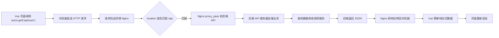

### API 请求解释

前端代码里写：

```js
axios.get('/api/user')
```

浏览器实际请求的是：

```text
https://web.example.com/api/user
```

因为它和前端页面同域，所以浏览器不会认为这是跨域请求。

Nginx 收到 `/api/user` 后，根据配置转发：

```nginx
location /api {
  proxy_pass http://api.example.com:8080;
  proxy_set_header Host $host;
  proxy_set_header X-Real-IP $remote_addr;
  proxy_set_header X-Forwarded-For $proxy_add_x_forwarded_for;
  proxy_set_header X-Forwarded-Proto $scheme;
}
```

最终链路是：

```text
浏览器 -> Nginx -> 后端 API 服务器 -> Nginx -> 浏览器
```

这就是反向代理。

浏览器以为自己只访问了 `web.example.com`，但 Nginx 在服务端内部把请求转发给了真正的后端 API 服务器。

## 11. 反向代理与跨域

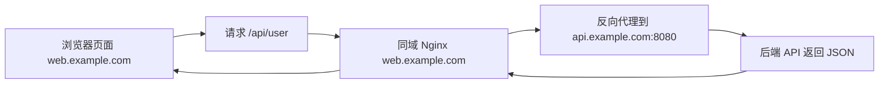

### 反向代理解释

跨域是浏览器的安全限制。它关心的是：

```text
协议 + 域名 + 端口
```

比如：

```text
前端页面：https://web.example.com
后端接口：https://api.example.com
```

这两个域名不同，浏览器直接请求可能触发跨域限制。

反向代理的解决方式是让浏览器只访问同一个域名：

```text
浏览器 -> https://web.example.com/api/user
```

然后由 Nginx 在服务器侧转发：

```text
Nginx -> http://api.example.com:8080/api/user
```

服务器之间没有浏览器同源策略限制，所以 Nginx 可以帮你“隐藏跨域”。

另一种方案是让后端配置 CORS 响应头，告诉浏览器允许跨域访问。

## 12. 正向代理与反向代理

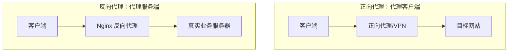

### 代理解释

正向代理是“客户端找代理”：

```text
你的电脑 -> 代理服务器 -> 目标网站
```

目标网站看到的是代理服务器的 IP，不一定知道真实客户端是谁。

反向代理是“服务端放代理”：

```text
浏览器 -> Nginx -> 后端 API 服务器
```

浏览器只知道 Nginx，不知道后端 API 服务器在哪里。

前端部署里最常见的是反向代理。

## 13. HTTP、HTTPS、TCP/IP 的关系

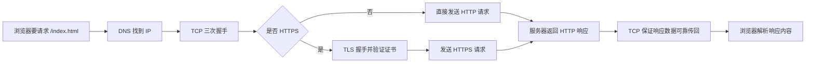

### TCP/IP 解释

HTTP 是应用层协议，定义请求和响应长什么样。

例如：

```http
GET /index.html HTTP/1.1
Host: web.example.com
```

TCP 负责可靠传输。它保证数据尽量完整、有序地到达对方。

IP 负责寻址和路由。它负责把数据包送到目标 IP。

DNS 负责把域名变成 IP。

HTTPS = HTTP + TLS。TLS 负责加密和身份校验。

层级可以这样记：

```text
浏览器业务行为：我要页面
HTTP：我要 GET /index.html
TLS：如果是 HTTPS，先加密并验证证书
TCP：建立连接并可靠传输
IP：把数据包送到目标 IP
DNS：把域名翻译成 IP
```

## 14. HTTPS 建立连接流程

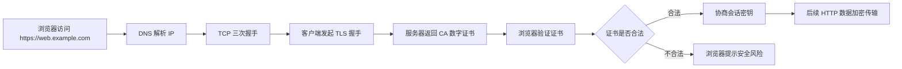

### HTTPS 解释

HTTPS 比 HTTP 多了一层 TLS。

TLS 做两件重要的事：

- 验证服务器是不是你要访问的那个网站。
- 加密后续传输内容，避免明文泄露。

证书里通常包含：

- 域名
- 公钥
- 有效期
- 签发机构
- 数字签名

浏览器会用系统内置的根 CA 证书链去验证它是否合法。

验证通过后，浏览器和服务器协商出会话密钥，后续 HTTP 数据就通过 TLS 加密传输了。

## 15. Nginx 配置在流程图里的位置

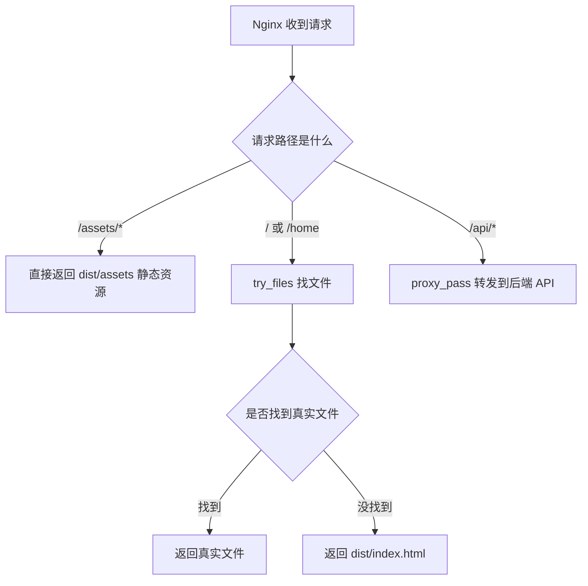

### Nginx 解释

Nginx 在这条链路中常见职责有三个：

- 静态资源服务器：返回 `dist/index.html`、JS、CSS、图片。
- SPA 路由兜底：刷新 `/home`、`/user/profile` 时返回 `index.html`。
- 反向代理服务器：把 `/api/*` 转发到后端 API。

示例配置：

```nginx
server {
    listen 80;
    server_name web.example.com;

    root /var/www/web-example;
    index index.html;

    location /api {
        proxy_pass http://api.example.com:8080;
        proxy_set_header Host $host;
        proxy_set_header X-Real-IP $remote_addr;
        proxy_set_header X-Forwarded-For $proxy_add_x_forwarded_for;
        proxy_set_header X-Forwarded-Proto $scheme;
    }

    location / {
        try_files $uri $uri/ /index.html;
    }
}
```

这段配置不参与打包，不会影响 Rollup tree-shaking。它只决定请求来了以后怎么处理。

## 16. 适合画 SVG 的节点清单

| 节点 ID | 节点名称 | 分组 | 说明 |
| --- | --- | --- | --- |
| N01 | 开发者源码 | 构建阶段 | `src` 目录、Vue 组件、TS、CSS、图片等原始代码。 |
| N02 | 流水线 CI/CD | 构建阶段 | 自动拉代码、装依赖、构建、部署。 |
| N03 | npm run build | 构建阶段 | 执行构建脚本，通常触发 `vite build`。 |
| N04 | 构建工具 | 构建阶段 | Vite、Rollup、Webpack、esbuild 负责加工源码。 |
| N05 | dist | 构建产物 | 浏览器可直接访问的 HTML、JS、CSS、图片。 |
| N06 | Nginx 源站 | 部署运行 | 保存或读取 `dist`，对外提供静态资源，也可做代理。 |
| N07 | CDN 节点 | 部署运行 | 缓存静态资源，让用户从更近的节点下载。 |
| N08 | 域名 | 访问入口 | 人类可读的网站名称，例如 `web.example.com`。 |
| N09 | DNS | 网络基础 | 把域名解析成 CDN 或源站 IP。 |
| N10 | 浏览器客户端 | 客户端 | 发请求、接响应、解析资源、执行 JS、渲染页面。 |
| N11 | TCP/IP | 网络传输 | IP 负责寻址，TCP 负责可靠传输。 |
| N12 | TLS/HTTPS | 安全传输 | 验证证书并加密 HTTP 数据。 |
| N13 | HTML/CSS/JS | 静态资源 | 从 `dist` 下载到浏览器的文件。 |
| N14 | Vue 应用 | 浏览器运行时 | JS 执行后创建 Vue 应用，挂载并渲染组件。 |
| N15 | Vue Router | 浏览器运行时 | 根据 URL 匹配前端页面组件。 |
| N16 | API 请求 | 数据请求 | 前端 JS 发出的 `/api/*` 请求。 |
| N17 | Nginx 反向代理 | 服务端代理 | 接收 `/api/*` 并转发给后端 API。 |
| N18 | 后端 API 服务器 | 服务端 | 处理业务逻辑、查询数据库、返回 JSON。 |
| N19 | JSON 响应 | 数据响应 | 后端返回给前端的数据。 |
| N20 | 页面更新 | 浏览器渲染 | Vue 接收数据后更新响应式状态并重新渲染。 |

## 17. 适合画 SVG 的连线清单

| 连线 ID | 起点 | 终点 | 连线文案 | 说明 |
| --- | --- | --- | --- | --- |
| E01 | N01 | N02 | 提交代码 | 开发者把源码推到 Git 仓库后触发流水线。 |
| E02 | N02 | N03 | 执行构建 | 流水线运行 `npm run build`。 |
| E03 | N03 | N04 | 调用构建工具 | 构建脚本调用 Vite/Rollup/Webpack/esbuild。 |
| E04 | N04 | N05 | 输出产物 | 构建工具生成 `dist`。 |
| E05 | N05 | N06 | 部署到源站 | 把 `dist` 上传到 Nginx 服务器目录。 |
| E06 | N05 | N07 | 部署到 CDN | 把静态资源上传到对象存储或 CDN。 |
| E07 | N10 | N08 | 输入域名 | 用户在浏览器访问网站。 |
| E08 | N08 | N09 | 查询解析 | 浏览器通过 DNS 查询域名对应 IP。 |
| E09 | N09 | N07 | 返回 CDN IP | 接入 CDN 时，DNS 返回附近 CDN 节点 IP。 |
| E10 | N09 | N06 | 返回源站 IP | 未接入 CDN 时，DNS 返回源站 Nginx IP。 |
| E11 | N10 | N11 | 建立连接 | 浏览器基于 TCP/IP 连接目标 IP。 |
| E12 | N11 | N12 | HTTPS 握手 | HTTPS 站点需要 TLS 握手。 |
| E13 | N10 | N07 | 请求静态资源 | 浏览器向 CDN 请求 HTML/CSS/JS。 |
| E14 | N10 | N06 | 请求静态资源 | 浏览器向 Nginx 请求 HTML/CSS/JS。 |
| E15 | N07 | N06 | 回源 | CDN 未命中缓存时去源站拉资源。 |
| E16 | N06 | N13 | 返回 dist 文件 | Nginx 返回静态资源。 |
| E17 | N07 | N13 | 返回缓存文件 | CDN 返回缓存的静态资源。 |
| E18 | N13 | N10 | 下载完成 | 浏览器拿到 HTML/CSS/JS。 |
| E19 | N10 | N14 | 执行 JS | 浏览器执行 Vue 应用代码。 |
| E20 | N14 | N15 | 匹配路由 | Vue Router 根据 URL 渲染页面。 |
| E21 | N14 | N16 | 发起接口请求 | 页面逻辑调用 `axios.get('/api/user')`。 |
| E22 | N16 | N17 | 匹配 /api | Nginx 识别 API 路径。 |
| E23 | N17 | N18 | proxy_pass | Nginx 反向代理到后端 API。 |
| E24 | N18 | N19 | 返回数据 | 后端处理业务后返回 JSON。 |
| E25 | N19 | N20 | 更新页面 | 浏览器收到 JSON，Vue 更新页面。 |

## 18. 推荐 SVG 分组方式

```text
分组 A：构建阶段
N01 开发者源码
N02 流水线 CI/CD
N03 npm run build
N04 构建工具
N05 dist

分组 B：部署与分发
N06 Nginx 源站
N07 CDN 节点

分组 C：网络连接
N08 域名
N09 DNS
N11 TCP/IP
N12 TLS/HTTPS

分组 D：客户端运行
N10 浏览器客户端
N13 HTML/CSS/JS
N14 Vue 应用
N15 Vue Router
N20 页面更新

分组 E：业务数据
N16 API 请求
N17 Nginx 反向代理
N18 后端 API 服务器
N19 JSON 响应
```

## 19. 最终心智模型

```text
构建工具负责生产 dist。
流水线负责把 dist 送到线上环境。
域名负责给访问入口起名字。
DNS 负责把域名翻译成 IP。
CDN 负责缓存并就近返回静态资源。
Nginx 负责返回静态文件、SPA 兜底、反向代理 API。
浏览器负责发送请求、接收响应、解析资源、执行 JS、渲染页面。
TCP/IP 负责底层传输。
HTTPS/TLS 负责加密和身份校验。
后端 API 服务器负责处理真实业务数据。
```

