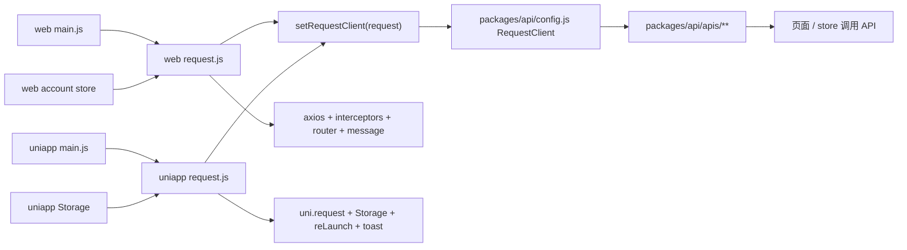

## 分析范围

本次按 `$vue-components-communication` 的方式，不把它们只当成“几个普通 JS 文件”，而是当成一条完整的项目级通信链路来分析：

- `travel-web/sites/uniapp/src/utils/request.js`
- `travel-web/packages/api/src/config.js`
- `travel-web/packages/api/src/index.js`
- `travel-web/packages/api/src/apis/**`
- `travel-web/sites/web/src/utils/request.js`
- 补充启动节点：
  - `travel-web/sites/web/src/main.js`
  - `travel-web/sites/uniapp/src/main.js`
- 补充状态节点：
  - `travel-web/sites/web/src/store/modules/account.js`
  - `travel-web/sites/uniapp/src/store/modules/account.js`

---

## 一句话先讲清楚

这套结构的核心不是“`uniapp` 和 `web` 共用同一个 axios 实例”，而是：

**共享 API 包只依赖 `RequestClient` 这个抽象入口，再由 `web` 和 `uniapp` 在各自启动时注入自己的请求实现。**

所以这里真正共用的是：

- 同一套 API 函数定义
- 同一种调用协议
- 同一份 `RequestClient({ url, method, data, params, loading })` 请求描述格式

而不是共用一个具体请求库实例。

---

## 节点分层表

| 节点 | 类型判断 | 持有的真实状态 | 接收什么 | 发出什么 |
|---|---|---|---|---|
| `sites/web/src/main.js` | App 启动节点 | 不持有业务状态 | `request.js` 副作用导入 | 完成 web 端请求实现注册 |
| `sites/uniapp/src/main.js` | App 启动节点 | 不持有业务状态 | `request.js` 副作用导入 | 完成 uniapp 端请求实现注册 |
| `packages/api/src/config.js` | 共享运行时桥接节点 | `RequestClient` 当前实现引用 | 来自平台端的 `setRequestClient(client)` | 给 API 包提供统一请求入口 |
| `packages/api/src/apis/**` | 共享业务服务层 | 不持有平台状态 | `url/method/data/params/loading` | 调用 `RequestClient(config)` |
| `sites/web/src/utils/request.js` | web 端运行时适配层 | axios 实例、loading 计数、错误处理规则 | API 配置对象 | 真正发起 web 请求并返回统一结果 |
| `sites/uniapp/src/utils/request.js` | uniapp 端运行时适配层 | `uni.request` 封装、header 组装、跳登录规则 | API 配置对象 | 真正发起 uniapp 请求并返回统一结果 |
| `sites/web/src/store/modules/account.js` | web 登录态真实持有者 | `token`、`accountId` 等 | 登录接口返回值 | 给 web request 注入鉴权头 |
| `sites/uniapp/src/store/modules/account.js` | uniapp 登录态流程节点 | `isLogin`、`accountInfo` 等，外加 storage 同步 | 登录接口返回值 | 把 token/accountId 写入 Storage，供 uniapp request 读取 |

---

## 项目级节点表

### App

#### web

- `travel-web/sites/web/src/main.js:1`
- 启动时先执行：

```js
import '@/utils/request.js';
```

- 这不是普通引用，而是“先执行副作用”
- 目的是在页面真正调用 `@travel/api` 之前，先完成 `setRequestClient(requestFn)`

#### uniapp

- `travel-web/sites/uniapp/src/main.js:2`
- 同样先执行：

```js
import '@/utils/request.js';
```

- 作用完全一致，只是注册的是 uniapp 版本请求实现

### store

#### web store

- `travel-web/sites/web/src/store/modules/account.js`
- `token`、`accountId` 是 web 端请求头的真实来源
- `request.js` 通过 `useAccountStore()` 直接读取 store 中的登录态

#### uniapp store

- `travel-web/sites/uniapp/src/store/modules/account.js`
- 登录成功后把 token 拆分并写入：
  - `AUTHORIZATION`
  - `AUTHORIZATIONID`
  - `ACCOUNT_SOURCE`
- `uniapp` 请求层不是直接从 store 拿 token，而是从 Storage 读

### services

这条链路里最接近 `services` 角色的，其实是下面三层：

- `packages/api/src/config.js`
  共享运行时桥
- `packages/api/src/apis/**`
  共享业务 API 定义层
- `sites/*/src/utils/request.js`
  平台请求适配层

所以这不是组件树通信，更像：

**App 启动节点 -> 平台适配层 -> 共享桥接层 -> 共享 API 层**

### Storage

当前链路里，Storage 主要由 uniapp 使用：

- `AUTHORIZATION`
- `AUTHORIZATIONID`
- `ACCOUNT_SOURCE`
- `loginInfo`

web 端这条链主要依赖 Pinia 持久化后的 store，而不是请求时直接读 `localStorage`

### API

- `travel-web/packages/api/src/index.js`
- `travel-web/packages/api/src/apis/index.js`

它们负责把所有业务接口统一导出，让页面只依赖 `@travel/api`

---

## 关键链路表

| 链路 | 状态被谁持有 | 方法被谁触发 | 数据传给谁 | 改完怎么回流 |
|---|---|---|---|---|
| web 请求注册 | `config.js` 持有 `RequestClient` 引用 | `web/main.js` 导入 `web/request.js` 时触发 | `web/request.js -> setRequestClient(requestFn)` | 后续所有 API 调用都落到 `requestFn` |
| uniapp 请求注册 | `config.js` 持有 `RequestClient` 引用 | `uniapp/main.js` 导入 `uniapp/request.js` 时触发 | `uniapp/request.js -> setRequestClient(request)` | 后续所有 API 调用都落到 `request` |
| 共享 API 调用 | 真实请求实现不在 API 层持有 | 页面/store 调用具体 API 函数时触发 | `apis/** -> RequestClient(config)` | 返回统一数据给页面或 store |
| web 鉴权头注入 | `web/account store` 持有 token/accountId | `service.interceptors.request` 触发 | token 写入 headers | 响应异常时再通过 logout/router 回流 |
| uniapp 鉴权头注入 | Storage 持有 token/accountId | `uni.request` 前组装 header 时触发 | token 写入 headers | 响应异常时通过 logout/reLaunch 回流 |
| 登录态建立 | web: store；uniapp: store + Storage | 登录接口成功后触发 | 请求层读取这些状态 | 后续请求都自动带鉴权头 |

---

## Storage 总表

| key | 写入者 | 读取者 | 触发时机 | 业务语义 |
|---|---|---|---|---|
| `AUTHORIZATION` | `sites/uniapp/src/store/modules/account.js` | `sites/uniapp/src/utils/request.js` | uniapp 登录成功后写入；退出登录时删除 | uniapp 请求 token |
| `AUTHORIZATIONID` | `sites/uniapp/src/store/modules/account.js` | `sites/uniapp/src/utils/request.js` | uniapp 登录成功后写入；退出登录时删除 | uniapp 账号 ID |
| `ACCOUNT_SOURCE` | `sites/uniapp/src/store/modules/account.js` | 主要用于状态恢复/环境标记 | uniapp 登录成功后写入；退出登录时删除 | 当前账号来源标识 |
| `loginInfo` | `sites/uniapp/src/store/modules/account.js` | uniapp 其他流程可恢复读取 | `getSystemInfo()` 成功后写入 | 当前登录后的完整资料缓存 |

补充说明：

- uniapp 这条链把“请求鉴权状态”放在 Storage
- web 这条链把“请求鉴权状态”放在 store，并通过 Pinia 持久化配置保留
- 所以两个端的 source of truth 不完全一样：
  - web：store 是请求时直接读取点
  - uniapp：Storage 是请求时直接读取点

---

## 这几个文件分别负责什么

## 1. `packages/api/src/config.js`

它不是请求实现层，它是“共享抽象层”。

源码非常短：

```js
let RequestClient;
function setRequestClient(client) {
  RequestClient = client;
}
export { setRequestClient, RequestClient };
```

它的职责只有两个：

- 暴露 `RequestClient`
- 允许平台端把真正实现注册进来

这里最关键的不是语法，而是职责边界：

- `config.js` 不知道什么是 axios
- `config.js` 也不知道什么是 `uni.request`
- 它只知道“这里需要一个可调用的请求客户端”

按 `$vue-components-communication` 的语言来说，这个节点传递的不是“值”也不是“动作”，而是：

**运行时控制权**

也就是：

- 由哪个平台来决定“真正如何请求”

---

## 2. `packages/api/src/apis/**`

这一层是共享 API 定义层。

例如 `travel-web/packages/api/src/apis/system/login.js`：

```js
export function login(data, loading = false) {
  return RequestClient({ url: '/web/login', method: 'post', data, loading });
}
```

这里的 API 函数只负责：

- 描述调用哪个接口
- 用什么方法
- 带什么参数

它不负责：

- token 从哪来
- 是否跳登录页
- 是否提示错误
- 底层到底用什么请求库

所以这层是典型的“业务服务定义层”，而不是“平台实现层”。

---

## 3. `sites/web/src/utils/request.js`

这是 web 端的运行时适配层。

它做了 4 件事：

### 3.1 创建 web 端请求引擎

```js
const service = axios.create({
  baseURL: VITE_BASE_URL,
  headers: { 'content-Type': 'application/json;charset=UTF-8' },
  timeout: 60 * 1000,
});
```

### 3.2 从 web store 读取登录态，统一加请求头

```js
const accountStore = useAccountStore();
headers.AUTHORIZATION = accountStore.token;
headers.AUTHORIZATIONID = accountId;
headers.ACCOUNT_SOURCE = 'web';
```

所以 web 端请求层依赖的是：

- Pinia store
- router
- TDesign 的消息和 loading 组件

### 3.3 统一处理响应和异常

它会处理：

- 业务码 `200`
- 鉴权异常 `401/403`
- 服务器异常 `500`
- 超时异常
- 二进制下载
- 分页字段数字化

### 3.4 把 web 实现注册给共享 API 层

```js
setRequestClient(requestFn);
```

这句话的语义是：

**以后这个运行环境里，`RequestClient` 的真实执行者就是 `requestFn`。**

---

## 4. `sites/uniapp/src/utils/request.js`

这是 uniapp 端的运行时适配层。

它和 web 端职责相同，但实现方式不同。

### 4.1 底层请求库不同

它不用 axios，而是：

```js
uni.request({...})
```

### 4.2 登录态来源不同

它不从 store 直接取 header，而是：

```js
const authToken = uni.getStorageSync("AUTHORIZATION");
const authId = uni.getStorageSync("AUTHORIZATIONID");
```

再统一加：

```js
header.ACCOUNT_SOURCE = "app";
```

### 4.3 跳转方式不同

web 端用：

- `router.push(...)`

uniapp 端用：

- `uni.reLaunch(...)`

### 4.4 仍然注册到同一个共享入口

```js
setRequestClient(request);
```

所以两端虽然底层不同，但上层 API 调用完全一致。

---

## 通信方式选择：为什么这里不用 props / emit / v-model

这套关系虽然用了 `$vue-components-communication` 来分析，但它本质上不是组件父子通信问题。

这里传递的内容不是：

- `props` 的值
- `emit` 的动作
- `v-model` 的双向绑定

而是：

- **平台请求能力的注册**
- **共享模块中的运行时控制权注入**

所以最合适的通信方式不是组件通信 API，而是：

### 1. 共享模块单例

`config.js` 被 `api` 层和平台层共同 import，天然形成同一个模块实例。

### 2. 依赖注入

由平台层调用：

```js
setRequestClient(client)
```

把实际请求能力注入给公共层。

### 3. 副作用导入确保初始化顺序

`main.js` 里先：

```js
import '@/utils/request.js';
```

保证页面或 store 真正调用 API 之前，`RequestClient` 已经注册完毕。

---

## 回流设计

按 skill 的“谁发起、谁处理、谁更新、谁重渲染”来看，这条链可以拆成下面几段。

### 链路 1：启动注册回流

1. `main.js` 发起副作用导入
2. `request.js` 执行并调用 `setRequestClient(...)`
3. `config.js` 更新 `RequestClient` 引用
4. `apis/**` 后续调用自动拿到已注册实现

这条链没有 UI 事件，没有组件回流，它是运行时初始化回流。

### 链路 2：业务 API 调用回流

1. 页面或 store 调用 `@travel/api` 某个函数
2. 该函数把配置对象传给 `RequestClient`
3. 当前平台注册的 request 实现真正发请求
4. 返回统一数据给页面或 store

### 链路 3：登录态回流

#### web

1. `account store` 登录成功后持有 `token/accountId`
2. `web/request.js` 请求前读取 store
3. 响应异常时 `request.js` 触发 `logout()`
4. store 被清空，router 跳回登录页

#### uniapp

1. `account store` 登录成功后写入 Storage
2. `uniapp/request.js` 请求前读取 Storage
3. 响应异常时 `request.js` 触发 `logout()`
4. Storage 被清空，`uni.reLaunch()` 回登录页

---

## 为什么这样设计更合适

### 封装性更好

- 共享 API 包不依赖具体平台
- 平台差异被隔离在各自 `request.js`

### 代码更简洁

- 接口地址只写一份
- 页面调用方式统一
- 不需要在每个 API 文件里写 `if (web) ... else if (uniapp) ...`

### 语义更明确

- `api` 层负责“我要请求什么”
- `request` 层负责“我怎么请求”
- `store / Storage` 负责“我的登录态从哪来”

这三个角色边界非常清楚。

---

## 当前结构里最值得记住的 3 个关键点

### 1. 真正的 source of truth 分平台不同

- web 请求鉴权头的真实来源是 `account store`
- uniapp 请求鉴权头的真实来源是 Storage

### 2. `config.js` 是桥，不是请求器

很多人第一次看会以为它“太简单了没用”，其实它正是整套可复用设计的核心桥接点。

### 3. `main.js` 的导入顺序非常关键

如果没有先导入 `request.js`，那 `RequestClient` 还没注册，`apis/**` 调用时就会失效。

所以：

```js
import '@/utils/request.js';
```

不是普通工具导入，而是启动初始化的一部分。

---

## 如果把这条链画成图，可以这样理解



---

## 结论

这 4 组文件之间的关系，可以归纳成下面这句话：

**`packages/api/src/config.js` 提供统一请求入口，`packages/api/src/apis/**` 只描述业务接口，`sites/web/src/utils/request.js` 和 `sites/uniapp/src/utils/request.js` 分别把 web/uniapp 的真实请求能力注入进去，而两个 `main.js` 负责在应用启动时完成这次注入。**

如果你后面要继续生成 canvas、流程图或项目讲解稿，这份关系已经可以直接作为“节点说明稿”继续往下扩展。
