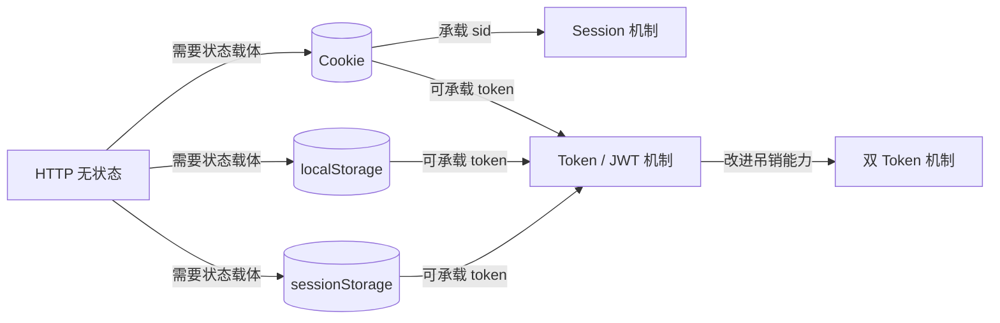
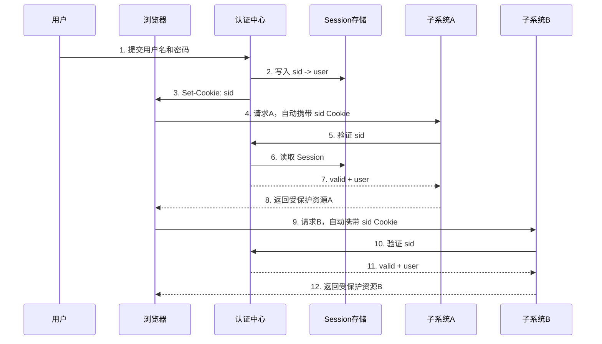
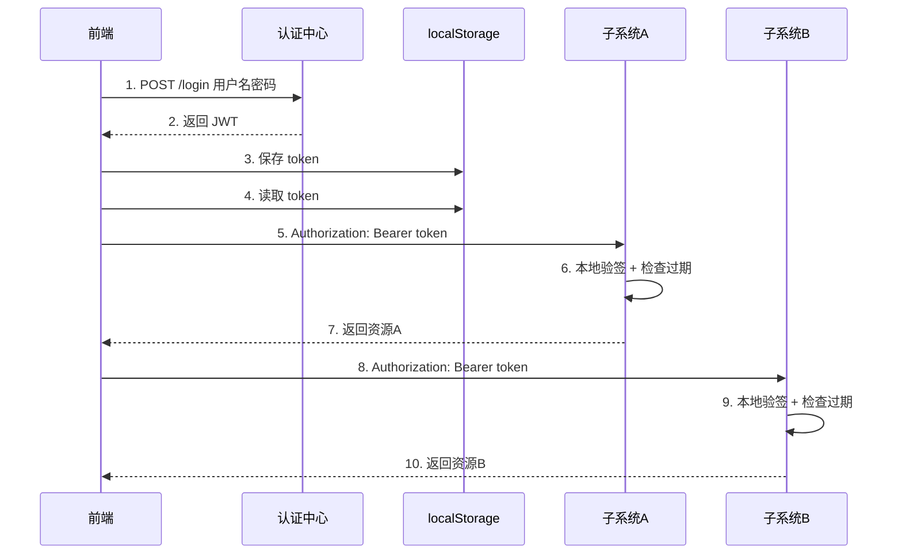
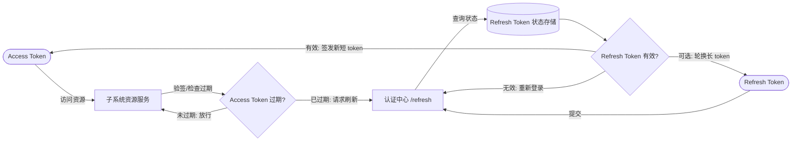
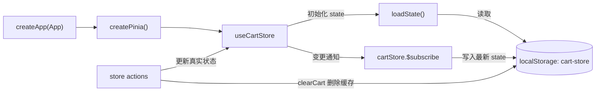
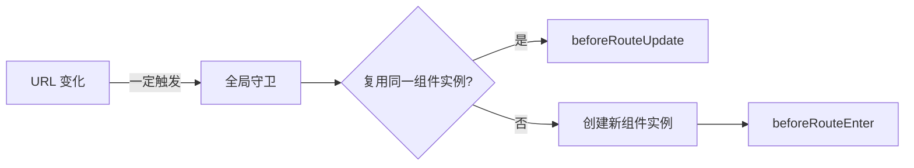

> 来源文档：`docs/codex1/cookie&&webStorage&&TOKNE.md`
>
> 目标：把原来的学习笔记拆成适合生成 SVG 的“分组 + 节点 + 连线 + 状态归属”结构。

## 0. SVG 生成约定

### 推荐分组

| groupId | 分组名 | 适合放置位置 | 说明 |
|---|---|---:|---|
| G_CLIENT | 浏览器 / 前端应用 | 左侧 | 用户、Vue App、路由守卫、Pinia store、axios 请求 |
| G_STORAGE | 浏览器存储 | 左下 | Cookie、localStorage、sessionStorage |
| G_AUTH | 认证中心 | 中间 | 登录验证、签发 sid/token、验证 sid、刷新 token |
| G_RESOURCE | 子系统 / 资源服务 | 右侧 | 子系统 A、子系统 B、受保护资源 |
| G_SERVER_STATE | 服务端状态 | 中下 | Session 存储、Refresh Token 存储、数据库/Redis |
| G_RUNTIME | 运行时机制 | 上方或背景层 | HTTP 无状态、自动携带、手动携带、签名验证 |

### 推荐节点形状

| type | SVG 形状 | 用途 |
|---|---|---|
| actor | 圆角矩形 | 用户、浏览器、Vue App |
| storage | 圆柱体 | Cookie、localStorage、Session 存储、Refresh Token 存储 |
| service | 矩形 | 认证中心、子系统 A/B |
| api | 六边形 | `/login`、`/auth/verify`、`/resource` |
| decision | 菱形 | sid 是否有效、token 是否过期、refresh token 是否有效 |
| token | 胶囊形 | sid、JWT、Access Token、Refresh Token |
| note | 便签 | 风险、优缺点、注意点 |

### 连线标签规范

| edgeLabel | 含义 |
|---|---|
| 写入 | 把状态写入某个存储 |
| 读取 | 从存储恢复状态 |
| 自动携带 | 浏览器自动把 Cookie 放进请求头 |
| 手动携带 | 前端代码手动把 token 放进 `Authorization` |
| 验证 | 服务端校验 sid / token / refresh token |
| 签发 | 认证中心生成 sid 或 token |
| 回流 | 状态变化后回到真实持有者 |
| 失效 | token / session 被清除或过期 |

## 1. 总览图：从存储技术到认证机制

### 图意

HTTP 本身无状态，所以需要“某个地方”保存登录状态或身份凭证。Cookie、localStorage、sessionStorage 是浏览器端存储技术；Session、Token、双 Token 是基于这些存储能力构建出来的认证机制。

### 节点清单

| id | label | groupId | type | 说明 |
|---|---|---|---|---|
| N_HTTP | HTTP 无状态 | G_RUNTIME | note | 每次请求天然互不认识 |
| N_BROWSER | 浏览器 / 前端应用 | G_CLIENT | actor | 发起登录和资源请求 |
| N_COOKIE | Cookie | G_STORAGE | storage | 小容量，可被浏览器自动携带 |
| N_LOCAL | localStorage | G_STORAGE | storage | 持久化本地存储，不自动进请求头 |
| N_SESSION_STORAGE | sessionStorage | G_STORAGE | storage | 标签页会话级存储，不自动进请求头 |
| N_SESSION | Session 机制 | G_AUTH | service | 服务端保存会话，客户端保存 sid |
| N_TOKEN | Token / JWT 机制 | G_AUTH | service | 客户端保存 token，服务端验签 |
| N_DOUBLE_TOKEN | 双 Token 机制 | G_AUTH | service | Access Token + Refresh Token |

### 连线清单

| from | to | label | 说明 |
|---|---|---|---|
| N_HTTP | N_COOKIE | 需要状态载体 | Cookie 可作为会话凭证载体 |
| N_HTTP | N_LOCAL | 需要状态载体 | localStorage 可保存前端手动管理的 token |
| N_COOKIE | N_SESSION | 承载 sid | Session 常用 Cookie 保存 session id |
| N_COOKIE | N_TOKEN | 可承载 token | token 也可以放 Cookie，但要注意 CSRF |
| N_LOCAL | N_TOKEN | 可承载 token | SPA 常见做法：localStorage 保存 token |
| N_SESSION_STORAGE | N_TOKEN | 可承载 token | 关闭标签页即失效，适合短会话 |
| N_TOKEN | N_DOUBLE_TOKEN | 改进吊销能力 | 单 token 难主动失效，双 token 增加刷新控制 |

### Mermaid 草图

## 2. 存储技术对比图

| id | 名称 | 真实持有者 | 自动发给服务端 | 生命周期 | 适合画图时的重点 |
|---|---|---|---|---|---|
| S_COOKIE | Cookie | 浏览器 | 是，同域或满足跨域凭证条件时自动携带 | `Expires` / `Max-Age` 控制 | “自动携带”是最大特征 |
| S_LOCAL | localStorage | 浏览器 | 否，必须 JS 读取后手动放请求头 | 持久化，除非手动清除 | “前端手动管理”是最大特征 |
| S_SESSION_STORAGE | sessionStorage | 浏览器标签页 | 否 | 关闭标签页即消失 | “标签页级临时状态” |
| S_SESSION_SERVER | Session 存储 | 服务端 / Redis / 内存 | 不适用 | 服务端过期策略控制 | “服务端有状态” |
| S_JWT | JWT | 客户端持有，服务端只验签 | 取决于放 Cookie 还是 Header | token 自带过期时间 | “无状态、自包含、验签” |
| S_REFRESH | Refresh Token | 客户端持有，服务端记录状态 | 一般手动提交给认证中心 | 长有效期，可吊销 | “有状态、可吊销、可换新” |

## 3. Session + Cookie 传统 SSO

### 图意

认证中心保存 `sid -> 用户信息` 的 Session 状态，浏览器保存 `sid` Cookie。访问子系统时，浏览器自动携带 Cookie，子系统再拿 sid 去认证中心验证。

### 状态归属

| 状态 | 真实持有者 | 写入者 | 读取者 | 语义 |
|---|---|---|---|---|
| 用户名 / 密码 | 用户输入，认证中心只用于校验 | 用户 | 认证中心登录接口 | 登录凭据，不应该长期保存到 Session |
| sid Cookie | 浏览器 Cookie | 认证中心 `Set-Cookie` | 浏览器自动携带，子系统读取 | 客户端会话凭证 |
| Session 数据 | 认证中心 / 服务端 Session 存储 | 认证中心登录接口 | 认证中心验证接口 | 服务端真实登录态 |
| 受保护资源 | 子系统 A/B | 子系统 | 浏览器 | 登录后可访问的数据 |

### 节点清单

| id | label | groupId | type |
|---|---|---|---|
| U | 用户 | G_CLIENT | actor |
| BROWSER | 浏览器 | G_CLIENT | actor |
| COOKIE_SID | Cookie: sid | G_STORAGE | storage |
| AUTH_LOGIN | 认证中心 `/auth/login` | G_AUTH | api |
| AUTH_SESSION | Session 存储 `sid -> user` | G_SERVER_STATE | storage |
| AUTH_VERIFY | 认证中心 `/auth/verify` | G_AUTH | api |
| APP_A | 子系统 A `/appA/data` | G_RESOURCE | service |
| APP_B | 子系统 B `/appB/data` | G_RESOURCE | service |
| RESOURCE_A | A 的受保护资源 | G_RESOURCE | api |
| RESOURCE_B | B 的受保护资源 | G_RESOURCE | api |

### 连线清单

| order | from | to | label | 说明 |
|---:|---|---|---|---|
| 1 | U | AUTH_LOGIN | 提交用户名密码 | 登录认证中心 |
| 2 | AUTH_LOGIN | AUTH_SESSION | 写入 | 生成 sid，并写入 `sid -> user` |
| 3 | AUTH_LOGIN | COOKIE_SID | Set-Cookie | 把 sid 写入浏览器 Cookie |
| 4 | BROWSER | APP_A | 自动携带 sid | 浏览器请求子系统 A |
| 5 | APP_A | AUTH_VERIFY | 验证 sid | 子系统 A 问认证中心 sid 是否有效 |
| 6 | AUTH_VERIFY | AUTH_SESSION | 读取 | 查找 sid 对应的用户 |
| 7 | AUTH_VERIFY | APP_A | 返回 valid/user | 认证中心返回验证结果 |
| 8 | APP_A | RESOURCE_A | 放行 | 返回 A 的受保护资源 |
| 9 | BROWSER | APP_B | 自动携带 sid | 用户访问子系统 B，无需再次登录 |
| 10 | APP_B | AUTH_VERIFY | 验证 sid | 子系统 B 重复验证流程 |
| 11 | APP_B | RESOURCE_B | 放行 | 返回 B 的受保护资源 |

### Mermaid 草图

## 4. Token / JWT SSO

### 图意

认证中心只负责登录时签发 JWT。浏览器把 JWT 保存到 localStorage 或 Cookie。访问子系统时，前端通常手动把 JWT 放入 `Authorization: Bearer <token>`，子系统本地验签，不需要每次请求认证中心。

### 状态归属

| 状态 | 真实持有者 | 写入者 | 读取者 | 语义 |
|---|---|---|---|---|
| JWT | 浏览器本地存储 | 认证中心登录接口返回，前端保存 | axios 请求拦截器 / 请求函数 | 客户端身份凭证 |
| JWT payload | JWT 内部 | 认证中心签发 | 子系统验签后读取 | 用户 id、角色、过期时间等 |
| SECRET_KEY / 公钥 | 服务端 / 子系统 | 运维配置 | 认证中心签名，子系统验签 | 信任基础，不能暴露给前端 |
| 登录态判断 | 前端 store 或请求层 | 登录成功 / 登出 / 过期处理 | 路由守卫、请求函数 | 前端是否认为当前已登录 |

### 节点清单

| id | label | groupId | type |
|---|---|---|---|
| FE_LOGIN | 前端登录函数 `login()` | G_CLIENT | api |
| LOCAL_TOKEN | localStorage: token | G_STORAGE | storage |
| AUTH_TOKEN_LOGIN | 认证中心 `/login` | G_AUTH | api |
| JWT_TOKEN | JWT `header.payload.signature` | G_CLIENT | token |
| API_CLIENT | axios / fetch 请求层 | G_CLIENT | service |
| APP_A_RESOURCE | 子系统 A `/resource` | G_RESOURCE | service |
| APP_B_RESOURCE | 子系统 B `/resource` | G_RESOURCE | service |
| VERIFY_A | A 本地 `jwt.verify` | G_RESOURCE | api |
| VERIFY_B | B 本地 `jwt.verify` | G_RESOURCE | api |

### 连线清单

| order | from | to | label | 说明 |
|---:|---|---|---|---|
| 1 | FE_LOGIN | AUTH_TOKEN_LOGIN | 提交用户名密码 | 登录认证中心 |
| 2 | AUTH_TOKEN_LOGIN | JWT_TOKEN | 签发 | 生成 JWT |
| 3 | JWT_TOKEN | LOCAL_TOKEN | 写入 | 前端保存 token |
| 4 | API_CLIENT | LOCAL_TOKEN | 读取 | 请求前取 token |
| 5 | API_CLIENT | APP_A_RESOURCE | 手动携带 | `Authorization: Bearer token` |
| 6 | APP_A_RESOURCE | VERIFY_A | 验证 | 检查签名和过期时间 |
| 7 | VERIFY_A | APP_A_RESOURCE | 放行 / 拒绝 | 验证成功返回资源 |
| 8 | API_CLIENT | APP_B_RESOURCE | 手动携带 | 同一个 token 可访问 B |
| 9 | APP_B_RESOURCE | VERIFY_B | 验证 | B 独立验签 |

### Mermaid 草图

## 5. 双 Token 模式

### 图意

Access Token 短有效期、无状态，用于高频访问资源；Refresh Token 长有效期、有状态，用于向认证中心换新 Access Token。这样既保留分布式验签优势，又能通过吊销 Refresh Token 实现更强的控制。

### 状态归属

| 状态 | 真实持有者 | 是否有状态 | 用途 |
|---|---|---|---|
| Access Token | 浏览器保存，资源服务验签 | 通常无状态 | 高频访问资源 |
| Refresh Token | 浏览器保存，认证中心维护状态 | 有状态 | 换新 Access Token，支持吊销 |
| Refresh Token 状态 | 认证中心数据库 / Redis | 有状态 | 记录归属用户、是否吊销、是否已使用 |
| 强制下线状态 | 认证中心 | 有状态 | 通过拒绝 refresh 来阻断后续续期 |

### 节点清单

| id | label | groupId | type |
|---|---|---|---|
| ACCESS_TOKEN | Access Token | G_CLIENT | token |
| REFRESH_TOKEN | Refresh Token | G_CLIENT | token |
| REFRESH_STORE | Refresh Token 状态存储 | G_SERVER_STATE | storage |
| AUTH_REFRESH | 认证中心 `/refresh` | G_AUTH | api |
| TOKEN_EXPIRED | Access Token 是否过期 | G_RUNTIME | decision |
| REFRESH_VALID | Refresh Token 是否有效 | G_RUNTIME | decision |
| RESOURCE_SERVICE | 子系统资源服务 | G_RESOURCE | service |

### 连线清单

| order | from | to | label | 说明 |
|---:|---|---|---|---|
| 1 | ACCESS_TOKEN | RESOURCE_SERVICE | 访问资源 | 子系统本地验签 |
| 2 | RESOURCE_SERVICE | TOKEN_EXPIRED | 判断 | Access Token 过期则拒绝 |
| 3 | TOKEN_EXPIRED | AUTH_REFRESH | 请求刷新 | 前端携带 Refresh Token 找认证中心 |
| 4 | AUTH_REFRESH | REFRESH_STORE | 验证 | 查 Refresh Token 是否有效、是否吊销 |
| 5 | REFRESH_STORE | REFRESH_VALID | 返回状态 | 决定能否换新 |
| 6 | REFRESH_VALID | ACCESS_TOKEN | 签发新短 token | 有效则返回新 Access Token |
| 7 | REFRESH_VALID | REFRESH_TOKEN | 可选轮换 | 一次性 Refresh Token 会换新 |
| 8 | REFRESH_VALID | RESOURCE_SERVICE | 拒绝 | 无效则要求重新登录 |

### Mermaid 草图

## 6. Vue 项目中的状态与通信拆分

### 分层判断

| 层级 | 对应节点 | 应持有的状态 | 不应做的事 |
|---|---|---|---|
| 页面组件 / 容器组件 | 登录页、业务页面、App 启动入口 | 页面级登录态、路由跳转意图、是否需要恢复缓存 | 不直接散落多个 localStorage 读写点 |
| store | Pinia `account` / `cart` 等 | 跨页面共享状态、缓存恢复后的业务状态 | 不把纯 UI 展开状态塞进全局 |
| services / request 层 | axios 实例、认证服务模块 | token 注入、401/403 处理、刷新 token 副作用 | 不持有复杂 UI 状态 |
| Storage | Cookie / localStorage / sessionStorage | 持久化凭证或业务缓存 | 不作为唯一业务逻辑入口 |
| 展示组件 | 表单、按钮、列表项 | 输入草稿、hover、focus、展开收起 | 不知道接口、token、权限 |

### Pinia + localStorage 恢复链路

| 状态 | 真实持有者 | 写入者 | 读取者 | 回流方式 |
|---|---|---|---|---|
| `cartList` | Pinia `cart` store | `addCart/removeCart/clearCart` | 页面组件 / 购物车组件 | action 修改 store 后触发订阅 |
| `selectedIds` | Pinia `cart` store | `removeCart` 等 action | 结算区块 / 列表区块 | store 更新后组件重渲染 |
| `remark` | Pinia `cart` store | `updateRemark` | 备注输入框 / 提交逻辑 | 输入组件发起动作，store action 更新 |
| `cart-store` 缓存 | localStorage | `cartStore.$subscribe` | `state: () => loadState()` | 刷新时先读缓存，变更后同步写回 |

### Vue 状态恢复节点与边

| id | label | groupId | type |
|---|---|---|---|
| APP_CREATE | `createApp(App)` | G_CLIENT | service |
| PINIA_CREATE | `createPinia()` | G_CLIENT | service |
| CART_STORE | `useCartStore` | G_CLIENT | storage |
| LOAD_STATE | `loadState()` | G_CLIENT | api |
| CART_STORAGE | `localStorage: cart-store` | G_STORAGE | storage |
| STORE_ACTIONS | `addCart/removeCart/updateRemark/clearCart` | G_CLIENT | api |
| SUBSCRIBE | `cartStore.$subscribe` | G_CLIENT | api |

| order | from | to | label | 说明 |
|---:|---|---|---|---|
| 1 | APP_CREATE | PINIA_CREATE | 初始化 | 创建 Pinia |
| 2 | PINIA_CREATE | CART_STORE | 创建 store | store 初始化 |
| 3 | CART_STORE | LOAD_STATE | 读取初始 state | `state: () => loadState()` |
| 4 | LOAD_STATE | CART_STORAGE | 读取 | 从 localStorage 取缓存 |
| 5 | STORE_ACTIONS | CART_STORE | 更新 | action 修改真实业务状态 |
| 6 | CART_STORE | SUBSCRIBE | 通知 | store 变更触发订阅 |
| 7 | SUBSCRIBE | CART_STORAGE | 写入 | 把最新 state 持久化 |
| 8 | STORE_ACTIONS | CART_STORAGE | 删除 | `clearCart()` 同时移除缓存 |

### Mermaid 草图

## 7. 路由守卫触发图

### 图意

URL 变化时，全局守卫会执行；如果复用了同一个组件实例，组件不会重新创建，所以不会再次触发 `beforeRouteEnter`，而是触发 `beforeRouteUpdate`。

| id | label | groupId | type |
|---|---|---|---|
| ROUTE_CHANGE | URL 变化 | G_RUNTIME | event |
| GLOBAL_GUARD | 全局守卫 | G_CLIENT | api |
| SAME_COMPONENT | 是否复用同一组件实例 | G_RUNTIME | decision |
| BEFORE_ENTER | `beforeRouteEnter` | G_CLIENT | api |
| BEFORE_UPDATE | `beforeRouteUpdate` | G_CLIENT | api |
| COMPONENT_CREATE | 创建新组件实例 | G_CLIENT | service |

| from | to | label |
|---|---|---|
| ROUTE_CHANGE | GLOBAL_GUARD | 一定触发 |
| GLOBAL_GUARD | SAME_COMPONENT | 判断匹配结果 |
| SAME_COMPONENT | BEFORE_UPDATE | 是：组件复用 |
| SAME_COMPONENT | COMPONENT_CREATE | 否：创建新实例 |
| COMPONENT_CREATE | BEFORE_ENTER | 新实例进入 |

## 8. 适合生成 SVG 的总节点索引

| id | label | groupId | type | 推荐颜色 |
|---|---|---|---|---|
| BROWSER | 浏览器 / 前端应用 | G_CLIENT | actor | `#2563eb` |
| COOKIE_SID | Cookie: sid | G_STORAGE | storage | `#16a34a` |
| LOCAL_TOKEN | localStorage: token | G_STORAGE | storage | `#16a34a` |
| CART_STORAGE | localStorage: cart-store | G_STORAGE | storage | `#16a34a` |
| AUTH_LOGIN | 认证中心登录接口 | G_AUTH | api | `#7c3aed` |
| AUTH_VERIFY | 认证中心 sid 验证接口 | G_AUTH | api | `#7c3aed` |
| AUTH_REFRESH | 认证中心 refresh 接口 | G_AUTH | api | `#7c3aed` |
| AUTH_SESSION | Session 存储 | G_SERVER_STATE | storage | `#ca8a04` |
| REFRESH_STORE | Refresh Token 状态存储 | G_SERVER_STATE | storage | `#ca8a04` |
| JWT_TOKEN | JWT | G_CLIENT | token | `#dc2626` |
| ACCESS_TOKEN | Access Token | G_CLIENT | token | `#dc2626` |
| REFRESH_TOKEN | Refresh Token | G_CLIENT | token | `#ea580c` |
| APP_A | 子系统 A | G_RESOURCE | service | `#0891b2` |
| APP_B | 子系统 B | G_RESOURCE | service | `#0891b2` |
| CART_STORE | Pinia cart store | G_CLIENT | storage | `#2563eb` |
| ROUTE_CHANGE | URL 变化 | G_RUNTIME | event | `#64748b` |

## 9. 适合生成 SVG 的总连线索引

| from | to | label | diagram |
|---|---|---|---|
| AUTH_LOGIN | COOKIE_SID | Set-Cookie 写入 sid | Session SSO |
| AUTH_LOGIN | AUTH_SESSION | 写入 Session | Session SSO |
| BROWSER | APP_A | 自动携带 Cookie | Session SSO |
| APP_A | AUTH_VERIFY | 查询 sid 是否有效 | Session SSO |
| AUTH_VERIFY | AUTH_SESSION | 读取 Session | Session SSO |
| AUTH_TOKEN_LOGIN | JWT_TOKEN | 签发 JWT | Token SSO |
| JWT_TOKEN | LOCAL_TOKEN | 写入 localStorage | Token SSO |
| API_CLIENT | LOCAL_TOKEN | 读取 token | Token SSO |
| API_CLIENT | APP_A_RESOURCE | Authorization 手动携带 | Token SSO |
| APP_A_RESOURCE | VERIFY_A | 本地验签 | Token SSO |
| ACCESS_TOKEN | RESOURCE_SERVICE | 访问资源 | 双 Token |
| REFRESH_TOKEN | AUTH_REFRESH | 申请刷新 | 双 Token |
| AUTH_REFRESH | REFRESH_STORE | 验证 refresh 状态 | 双 Token |
| REFRESH_VALID | ACCESS_TOKEN | 签发新 Access Token | 双 Token |
| CART_STORE | LOAD_STATE | 初始化读取缓存 | Pinia Storage |
| LOAD_STATE | CART_STORAGE | getItem | Pinia Storage |
| SUBSCRIBE | CART_STORAGE | setItem | Pinia Storage |
| ROUTE_CHANGE | GLOBAL_GUARD | 全局守卫触发 | 路由守卫 |
| SAME_COMPONENT | BEFORE_UPDATE | 复用组件实例 | 路由守卫 |
| COMPONENT_CREATE | BEFORE_ENTER | 新建组件实例 | 路由守卫 |

## 10. SVG 绘制建议

1. 先画总览图，再分别画 `Session + Cookie`、`Token / JWT`、`双 Token`、`Pinia + localStorage` 四张细图。
2. 所有“真实状态持有者”用更粗边框：Session 存储、Refresh Token 状态存储、Pinia store。
3. Cookie 相关连线用“自动携带”，localStorage / token 相关连线用“手动携带”，这样一眼能区分两种认证风格。
4. 双 Token 图里要把 Access Token 和 Refresh Token 分开画：短 token 走资源服务，长 token 只走认证中心。
5. Vue 图里把 `Storage` 当持久化层，把 `store` 当业务状态真实持有者；不要把 localStorage 画成业务逻辑的中心。
