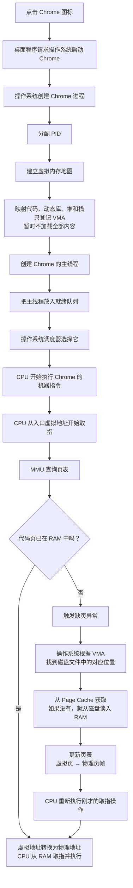

Chrome
  └── 提交任务：打开窗口、解析网页、执行 JavaScript

操作系统内核
  └── 决定哪个线程现在可以使用 CPU

CPU
  └── 真正执行机器指令

### chrome 多进程
Chrome
├── 浏览器主进程
│   ├── 窗口
│   ├── 地址栏
│   ├── 标签页管理
│   └── 用户操作
│
├── 渲染进程
│   ├── 解析 HTML
│   ├── 计算 CSS
│   ├── 执行 JavaScript
│   └── 生成页面画面
│
├── 网络服务进程
│   ├── DNS
│   ├── HTTP
│   └── TCP / TLS
│
└── GPU 进程
    └── 图层合成和图形相关工作

### 操作系统启动 chrome 浏览器
#### 一、 建立阶段（图中前6步）：只画图纸，不搬砖

图中说的：

> 建立虚拟内存地图\
> ↓\
> 映射代码、动态库、堆和栈

这就是我们上一步聊的**第1步：初始化默认建立的“虚拟地址空间布局（VMA）”**。

- **建立虚拟内存地图**：操作系统会为 Chrome 进程画一张“大饼”，规定好：
  - 从 `0x400000` 开始是代码区（可读可执行）；
  - 往下是数据区；
  - 中间一大块空白是堆（可读写）；
  - 高地址是栈（可读写）；
  - 还有一块区域留给动态库（如 `libchrome.so`）。
- **映射代码、动态库、堆和栈**：这里用的词是“映射”，而不是“加载”。
  - 操作系统只是在 VMA 结构体里记录：“这块虚拟地址对应磁盘上的 `/opt/google/chrome/chrome` 这个文件，偏移量是多少，权限是 `r-x`”。
  - **此时，Chrome 的代码和数据绝大部分都还在磁盘的 SSD/硬盘里，并没有被读进 RAM。** 物理内存里只是建了一些内核数据结构（VMA、页表雏形）。
- **分配 PID、创建主线程、放入就绪队列**：这时候进程只是一个“空壳”，有了身份证（PID）和干活的工人（主线程），但这个工人还不知道要干什么，因为代码还没进内存。

#### 二、 执行阶段（图中最后两步）：触发缺页，按需搬砖

图中说的：

> 操作系统调度器选择它\
> ↓\
> CPU 开始执行 Chrome 的机器指令

这里就是**真正触发“按需加载”的魔法时刻**！

1. **CPU 开始执行**：调度器选中 Chrome 主线程，CPU 把 `RIP` 寄存器指向 Chrome 的入口虚拟地址（比如 `0x400000`）。
2. **MMU 查表**：CPU 拿着虚拟地址去问 MMU，MMU 去查页表。
3. **触发缺页异常**：因为刚才只建了 VMA（图纸），没填页表（物理映射），MMU 发现“这一页不存在”。
4. **内核介入**：操作系统接管，根据出错的虚拟地址，找到刚才建的 VMA，知道它对应磁盘上的哪个文件。
5. **文件进 RAM**：内核去 Page Cache 找，如果没有，就从磁盘把这段代码**读进 RAM**。
6. **填页表**：内核在页表里填上“虚拟页 `0x400` -> 物理页帧 `0x12345`”。
7. **重新执行**：CPU 再次执行刚才的指令，这次 MMU 翻译成功，CPU 从 RAM/缓存取出指令，放进寄存器执行。

#### mermaid
