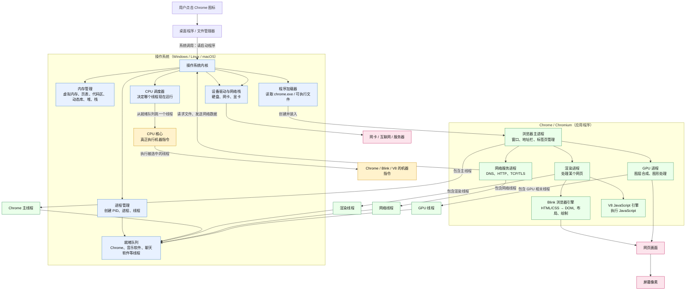

Chrome
  └── 提交任务：打开窗口、解析网页、执行 JavaScript

操作系统内核
  └── 决定哪个线程现在可以使用 CPU

CPU
  └── 真正执行机器指令

### chrome 多进程
Chrome
├── 浏览器主进程
│   ├── 窗口
│   ├── 地址栏
│   ├── 标签页管理
│   └── 用户操作
│
├── 渲染进程
│   ├── 解析 HTML
│   ├── 计算 CSS
│   ├── 执行 JavaScript
│   └── 生成页面画面
│
├── 网络服务进程
│   ├── DNS
│   ├── HTTP
│   └── TCP / TLS
│
└── GPU 进程
    └── 图层合成和图形相关工作

