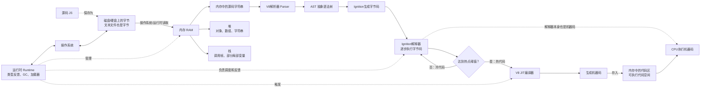
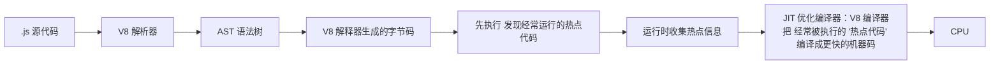
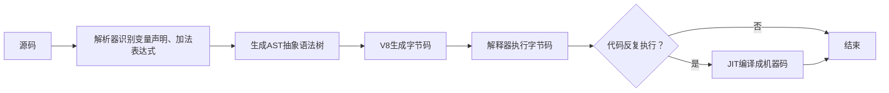

### 总链路
[[CPU、操作系统、chrome]]
[[CPU、操作系统、chrome#image 版]]
	Chrome进程启动
	  ↓
	创建渲染进程和线程
	  ↓
	初始化V8运行时
	  ↓

**JS V8 运行时：**代码先以“**磁盘上的字节**”存在，**运行时**把这些内容放入**内存**，经过解析得到结构，再由解释器执行（这一步已经是机器码了），解释器发现热点，继续由编译器翻译成机器码，最后由 **CPU 执行**。


### JS、V8、解释器、编译器之间的关系
JIT，Just-In-Time Compilation: 边运行边编译 ：先解释执行，运行过程中发现热点代码，再即时编译
热代码：字节码 → JIT编译器 → 机器码 → 存入内存 → CPU执行机器码
冷代码：字节码 → Ignition解释器 → CPU执行解释器机器码

#### 解析器和解释器不是一回事

| 组件              | 主要工作                     |
| --------------- | ------------------------ |
| 解析器 Parser      | 看代码是否符合语法，并构造 AST        |
| 解释器 Interpreter | 执行字节码或其他中间表示             |
| 编译器 Compiler    | 把代码翻译成更低层的表示，最终可以生成机器码   |
| 运行时 Runtime     | 提供内存管理、对象系统、异常、函数调用等执行环境 |

E.g: 
```js
let x = 1 + 2;
```



### 磁盘和内存
1. 磁盘/SSD固态硬盘（静态）
	保存的是可执行文件：二进制指令、常量、代码段。
	.xxx 程序/Java文件/源代码
2. 内存（运行时）
	保存**程序指令 + 当前执行位置 + 变量 / 上下文等全部运行时状态**。
	程序加载进内存后，操作系统会创建进程
