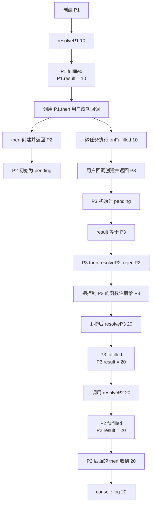
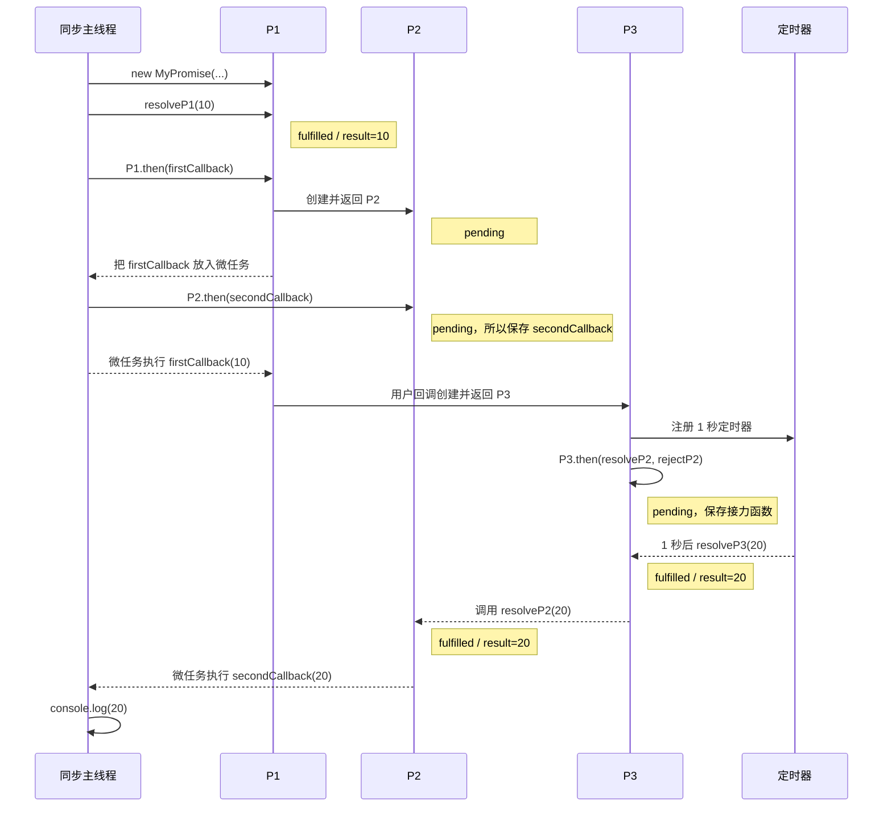

# Promise `then` 中 P1、P2、P3 的执行流程详解

> 学习目标：彻底弄懂 `return new Promise((resolve, reject) => {})` 中的 `resolve` 属于谁，以及 `result.then(resolve, reject)` 为什么能让一个 Promise 跟随另一个 Promise 的状态。

---

## 先说最终结论

下面这段代码中，最重要的是分清三个 Promise：

```js
// P1：最开始的 Promise
const p = new MyPromise(resolveP1 => {
  resolveP1(10)
})

// 第一次 then 返回 P2
const p2 = p.then(value => {
  // 用户回调返回 P3
  const p3 = new MyPromise(resolveP3 => {
    setTimeout(() => {
      resolveP3(value * 2)
    }, 1000)
  })

  return p3
})

// 第二次 then 监听 P2
p2.then(result => {
  console.log(result)
})
```

它们的关系是：

```text
P1 的结果是 10
      ↓
执行 P1 的成功回调：value => 返回 P3
      ↓
P3 一秒后成功，结果是 20
      ↓
P2 跟随 P3
      ↓
P2 也成功，结果是 20
      ↓
P2 后面的 then 打印 20
```

`result.then(resolveP2, rejectP2)` 的核心作用只有一句话：

> 把 P2 的成功和失败开关，交给 P3 的执行结果控制。

如果 P3 成功，就调用 `resolveP2`；如果 P3 失败，就调用 `rejectP2`。

---

## 这个 function 是干嘛的

`then(onFulfilled, onRejected)` 主要做四件事：

1. 接收成功回调和失败回调。
2. 当前 Promise 成功或失败后，执行相应回调。
3. 创建并返回一个全新的 Promise。
4. 根据回调的执行结果，决定新 Promise 是成功还是失败。

简化成一句话：

```text
then 读取旧 Promise 的结果，执行用户回调，再用回调的结果控制新 Promise。
```

---

## 它接收什么数据

`then` 接收两个参数：

```js
then(onFulfilled, onRejected)
```

### `onFulfilled`

旧 Promise 成功时执行：

```js
p.then(value => {
  console.log(value)
})
```

这里的：

```js
value => {
  console.log(value)
}
```

就是 `onFulfilled`。

### `onRejected`

旧 Promise 失败时执行：

```js
p.then(
  value => console.log('成功', value),
  reason => console.log('失败', reason)
)
```

第二个函数就是 `onRejected`。

它们的身份由参数位置决定：

```text
then(第一个参数, 第二个参数)
       ↓             ↓
 onFulfilled    onRejected
```

JavaScript 不会检查函数名，也不会分析函数内容。

---

## 它返回什么结果

每次调用 `then()`，都返回一个全新的 Promise：

```js
const p2 = p1.then(callback)
```

这里：

```text
p1：旧 Promise
p2：then 新建并返回的 Promise
```

一定要记住：

```js
console.log(p1 === p2) // false
```

P1 和 P2 是两个不同的对象，各自拥有自己的：

```js
state
result
callbacks
```

例如：

```js
const p1 = MyPromise.resolve(10)

const p2 = p1.then(value => {
  throw new Error('回调出错了')
})
```

最终可能是：

```text
P1：fulfilled，结果为 10
P2：rejected，原因为 Error
```

P2 失败不会把已经成功的 P1 改成失败，因为它们是两个独立的 Promise。

---

## 先给每个 `resolve` 改名

代码中所有参数都叫 `resolve`，非常容易看晕。

学习时，可以按照它所属的 Promise 给它改名：

```js
const p1 = new MyPromise(resolveP1 => {
  resolveP1(10)
})

const p2 = p1.then(value => {
  return new MyPromise(resolveP3 => {
    setTimeout(() => {
      resolveP3(value * 2)
    }, 1000)
  })
})
```

而 `then` 内部创建 P2 时，可以这样理解：

```js
return new MyPromise((resolveP2, rejectP2) => {
  // 这里控制的是 P2
})
```

因此，有三个不同的成功开关：

| 名称 | 属于谁 | 调用效果 |
|---|---|---|
| `resolveP1(10)` | P1 | P1 成功，结果为 10 |
| `resolveP2(20)` | P2 | P2 成功，结果为 20 |
| `resolveP3(20)` | P3 | P3 成功，结果为 20 |

虽然它们在源码中都叫 `resolve`，但它们不是同一个函数。

---

## `return new Promise((resolve, reject) => {})` 到底在做什么

原代码：

```js
then(onFulfilled, onRejected) {
  return new MyPromise((resolve, reject) => {
    // ...
  })
}
```

调用：

```js
const p2 = p1.then(callback)
```

等价理解：

```js
then(onFulfilled, onRejected) {
  const p2 = new MyPromise((resolveP2, rejectP2) => {
    // resolveP2 控制 p2 成功
    // rejectP2 控制 p2 失败
  })

  return p2
}
```

所以 `then` 内部的：

```js
resolve(result)
```

真正含义是：

```js
resolveP2(result)
```

也就是：

> 用用户回调的返回值，让 P2 成功。

### Promise 执行器什么时候执行

下面的执行器会立即执行：

```js
new MyPromise((resolveP2, rejectP2) => {
  console.log('立即执行')
})
```

但是 `then` 中的用户回调不会同步执行，因为 `handle` 使用了：

```js
queueMicrotask(() => {
  // 稍后执行回调
})
```

所以要区分：

```text
new Promise 的 executor：立即执行
then 中的 onFulfilled：进入微任务，稍后执行
```

---

## `handle` 中有两次不同的值传递

核心代码：

```js
const result = callback(this.result)
resolve(result)
```

很多初学者会把这两行看成同一件事，其实它们负责两个方向。

### 第一次传递：旧 Promise → 用户回调

```js
callback(this.result)
```

假设：

```js
this === P1
P1.result === 10
```

那么：

```js
callback(this.result)
```

就是：

```js
onFulfilled(10)
```

用户代码中的 `value` 才在这里真正接收到 `10`：

```js
p1.then(value => {
  // value 在函数执行时接收到 10
})
```

### 第二次传递：用户回调返回值 → 新 Promise

```js
const result = callback(this.result)
resolve(result)
```

如果用户回调返回普通值：

```js
p1.then(value => {
  return value * 2
})
```

执行过程是：

```js
const result = onFulfilled(10)
// result === 20

resolveP2(20)
// P2 成功，P2.result === 20
```

所以完整方向是：

```text
P1.result
   ↓ callback(this.result)
onFulfilled 的 value 参数
   ↓ return
局部变量 result
   ↓ resolveP2(result)
P2.result
```

### 原注释中需要纠正的地方

原注释类似：

```js
// 把旧 Promise 的 result 给了新 Promise 的 value 参数
```

这个描述不准确。

更准确的注释应该是：

```js
// 先把旧 Promise 的结果传给用户回调
const result = callback(this.result)

// 再用用户回调的返回值，决定新 Promise 的结果
resolve(result)
```

`value` 是用户成功回调的参数，不是新 Promise 的参数。

---

## `result.then(resolve, reject)` 到底是什么意思

核心代码：

```js
const result = callback(this.result)

if (result instanceof MyPromise) {
  result.then(resolve, reject)
} else {
  resolve(result)
}
```

学习时把名字全部展开：

```js
const result = onFulfilled(P1.result)

if (result instanceof MyPromise) {
  const p3 = result
  p3.then(resolveP2, rejectP2)
} else {
  resolveP2(result)
}
```

所以：

```js
result.then(resolve, reject)
```

真正表示：

```js
P3.then(resolveP2, rejectP2)
```

再把 `.then()` 的两个参数位置展开：

```js
P3.then(
  value => resolveP2(value),
  reason => rejectP2(reason)
)
```

也就是：

```text
P3 成功
   ↓
调用 resolveP2(P3的结果)
   ↓
P2 跟着成功

P3 失败
   ↓
调用 rejectP2(P3的原因)
   ↓
P2 跟着失败
```

这里利用了一个普通的 JavaScript 规则：函数可以作为参数传递。

下面两种写法的核心效果相同：

```js
P3.then(resolveP2, rejectP2)
```

```js
P3.then(
  value => resolveP2(value),
  reason => rejectP2(reason)
)
```

第一种只是更短。

---

## 为什么不能直接 `resolveP2(P3)`

在一个完整的 Promise 解析流程中，`resolve(P3)` 应该能够自动采用 P3 的状态。

但是当前这份教学版 `MyPromise` 的 `resolve` 只会简单保存值：

```js
const resolve = value => {
  this.state = 'fulfilled'
  this.result = value
}
```

如果直接执行：

```js
resolveP2(P3)
```

它可能只是把 P3 对象本身保存成 P2 的结果，而不是等待 P3。

所以教学代码手动写：

```js
P3.then(resolveP2, rejectP2)
```

明确告诉 P2：

> 先不要结束，等 P3；P3 成功你再成功，P3 失败你再失败。

---

## P1、P2、P3 的关系图



如果 Mermaid 没有渲染，也可以看下面的纯文本图：

```text
┌─────────────────────────────────────────────────────────┐
│ P1                                                      │
│ new MyPromise(resolveP1 => resolveP1(10))                │
│ state = fulfilled                                       │
│ result = 10                                             │
└──────────────────────────┬──────────────────────────────┘
                           │ P1.then(onFulfilled)
                           │ 创建 P2
                           ▼
┌─────────────────────────────────────────────────────────┐
│ P2                                                      │
│ 由第一次 then 创建                                      │
│ 初始 state = pending                                    │
│ resolveP2 / rejectP2 是控制 P2 的两个函数               │
└──────────────────────────┬──────────────────────────────┘
                           │ 微任务执行 onFulfilled(10)
                           ▼
┌─────────────────────────────────────────────────────────┐
│ 用户回调                                                │
│ value = 10                                              │
│ return new MyPromise(...)                               │
│ 返回值 result = P3                                      │
└──────────────────────────┬──────────────────────────────┘
                           ▼
┌─────────────────────────────────────────────────────────┐
│ P3                                                      │
│ 用户回调内部创建                                        │
│ 初始 state = pending                                    │
│ 一秒后 resolveP3(20)                                    │
└──────────────────────────┬──────────────────────────────┘
                           │
                           │ P3.then(resolveP2, rejectP2)
                           │
                 ┌─────────┴─────────┐
                 │                   │
                 ▼                   ▼
          P3 成功并得到 20        P3 失败并得到错误
                 │                   │
                 ▼                   ▼
          resolveP2(20)       rejectP2(error)
                 │                   │
                 ▼                   ▼
          P2 成功，结果 20       P2 失败
                 │
                 ▼
          下一个 then 打印 20
```

---

## 完整时间线：代码到底按什么顺序执行

示例：

```js
const p = new MyPromise(resolve => {
  resolve(10)
})

p.then(value => {
  return new MyPromise(resolve => {
    setTimeout(() => {
      resolve(value * 2)
    }, 1000)
  })
}).then(result => {
  console.log(result)
})
```

### 同步阶段 1：创建 P1

```js
const p = new MyPromise(resolveP1 => {
  resolveP1(10)
})
```

执行过程：

```text
创建 P1
  ↓
P1 的 constructor 执行
  ↓
executor 立即执行
  ↓
resolveP1(10)
  ↓
P1.state = fulfilled
P1.result = 10
```

### 同步阶段 2：调用第一次 `then`

```js
const p2 = p.then(onFulfilled)
```

`this` 是 P1。

`then` 创建 P2：

```js
return new MyPromise((resolveP2, rejectP2) => {
  // ...
})
```

P2 的 executor 立即执行。

它检查 P1：

```js
if (this.state === 'fulfilled') {
  handle(onFulfilled)
  return
}
```

此时：

```text
this === P1
P1.state === fulfilled
```

所以调用 `handle(onFulfilled)`。

但是 `handle` 内部使用：

```js
queueMicrotask(() => {
  // ...
})
```

因此只把任务放入微任务队列，暂时不执行用户回调。

当前 P2 仍然是：

```text
P2.state = pending
P2.result = undefined
```

### 同步阶段 3：调用第二次 `then`

链式写法：

```js
p.then(firstCallback).then(secondCallback)
```

第二次 `.then()` 是在 P2 上调用：

```js
p2.then(result => {
  console.log(result)
})
```

此时 P2 还没有结果，所以：

```js
P2.state === 'pending'
```

第二个回调先进入 P2 的 `callbacks`：

```js
P2.callbacks.push({
  onFulfilled: () => handle(secondCallback),
  onRejected: () => handle(secondOnRejected)
})
```

### 微任务阶段 1：执行 P1 的成功回调

同步代码结束后，执行第一次 `queueMicrotask`：

```js
const result = onFulfilled(P1.result)
```

也就是：

```js
const result = onFulfilled(10)
```

用户回调开始执行：

```js
value => {
  return new MyPromise(resolveP3 => {
    setTimeout(() => {
      resolveP3(value * 2)
    }, 1000)
  })
}
```

此时：

```text
value = 10
```

用户回调创建 P3。

P3 的 executor 立即执行，注册一个一秒定时器，然后返回 P3。

所以：

```js
result === P3
```

并且当前：

```text
P3.state = pending
```

### 微任务阶段 2：P2 开始跟随 P3

因为 `result` 是 P3：

```js
if (result instanceof MyPromise) {
  result.then(resolveP2, rejectP2)
}
```

等价于：

```js
P3.then(resolveP2, rejectP2)
```

由于 P3 还处于 `pending`，它会先保存这两个函数：

```text
P3.callbacks 中保存：

成功时调用 resolveP2
失败时调用 rejectP2
```

这时 P2 仍然是 `pending`，因为 P3 还没有完成。

### 一秒后：定时器执行

```js
resolveP3(value * 2)
```

因为 `value` 是 10：

```js
resolveP3(20)
```

于是：

```text
P3.state = fulfilled
P3.result = 20
```

然后 P3 执行之前保存的成功处理函数。

### 微任务阶段 3：P3 把结果交给 P2

P3 的成功回调实际上是：

```js
resolveP2
```

所以会发生：

```js
resolveP2(P3.result)
```

也就是：

```js
resolveP2(20)
```

于是：

```text
P2.state = fulfilled
P2.result = 20
```

P2 成功后，再执行之前保存的第二个 `.then()` 回调。

### 微任务阶段 4：打印结果

第二个 `.then()` 收到 P2 的结果：

```js
result => {
  console.log(result)
}
```

相当于：

```js
secondCallback(P2.result)
secondCallback(20)
```

最后打印：

```text
20
```

---

## 时间轴图



---

## `this` 到底指向谁

在第一次调用：

```js
P1.then(firstCallback)
```

`then` 方法中的：

```js
this === P1
```

里面的函数使用箭头函数：

```js
return new MyPromise((resolve, reject) => {
  const handle = callback => {
    queueMicrotask(() => {
      const result = callback(this.result)
    })
  }
})
```

箭头函数没有自己的 `this`，会沿着外层寻找。

所以第一次 `then` 中：

```js
this.result === P1.result
```

也就是 10。

当内部执行：

```js
P3.then(resolveP2, rejectP2)
```

这是另一次 `then` 调用。此时这次调用中的：

```js
this === P3
```

因此 P3 的 `handle` 读取的是：

```js
P3.result
```

也就是一秒后得到的 20。

---

## `pending` 为什么需要 `callbacks.push`

如果 Promise 已经成功：

```js
if (this.state === 'fulfilled') {
  handle(onFulfilled)
  return
}
```

已经有结果，可以安排执行成功回调。

如果 Promise 已经失败：

```js
if (this.state === 'rejected') {
  handle(onRejected)
  return
}
```

已经有原因，可以安排执行失败回调。

但是如果仍然是 `pending`：

```js
this.callbacks.push({
  onFulfilled: () => handle(onFulfilled),
  onRejected: () => handle(onRejected)
})
```

此时还不知道将来成功还是失败，也没有真实结果可以传入。

因此只能先保存两个“将来怎么处理”的函数：

```text
现在：先登记回调
将来成功：执行 onFulfilled
将来失败：执行 onRejected
```

`callbacks` 保存的是函数，不是异步结果本身。

真正的结果保存在：

```js
this.result
```

---

## 值穿透到底发生在哪里

默认成功回调：

```js
onFulfilled =
  typeof onFulfilled === 'function'
    ? onFulfilled
    : value => value
```

假设：

```js
P1.result === 20
```

用户没有给 `.then()` 传成功回调：

```js
const p2 = p1.then()
```

那么默认函数是：

```js
value => value
```

真正执行时：

```js
const result = onFulfilled(P1.result)
```

等价于：

```js
const result = (value => value)(20)
// result === 20
```

然后：

```js
resolveP2(result)
resolveP2(20)
```

所以值穿透不是单独某一行完成的，而是三步合作：

```text
value => value          原样返回旧值
callback(this.result)   执行默认函数并接住返回值
resolveP2(result)       把返回值交给新 Promise
```

---

## 错误穿透又是怎么发生的

默认失败回调必须写成：

```js
reason => {
  throw reason
}
```

不能写成：

```js
reason => throw reason // 语法错误
```

假设 P1 失败：

```text
P1.state = rejected
P1.result = Error
```

又没有传失败回调：

```js
p1.then(value => value)
```

默认失败回调执行：

```js
reason => {
  throw reason
}
```

抛出的错误会被 `handle` 中的 `catch` 捕获：

```js
try {
  const result = callback(this.result)
} catch (error) {
  rejectP2(error)
}
```

所以 P2 也失败，错误继续向后传递，直到某个 `.catch()` 或失败回调处理它。

---

## 根据返回值决定 P2 的状态

### 情况一：返回普通值

```js
const p2 = p1.then(value => {
  return value * 2
})
```

执行：

```js
const result = callback(10) // 20
resolveP2(20)
```

结果：

```text
P2 fulfilled，结果为 20
```

### 情况二：没有写 `return`

```js
const p2 = p1.then(value => {
  console.log(value)
})
```

函数默认返回 `undefined`：

```js
const result = undefined
resolveP2(undefined)
```

结果：

```text
P2 fulfilled，结果为 undefined
```

### 情况三：抛出异常

```js
const p2 = p1.then(() => {
  throw new Error('出错')
})
```

异常被捕获：

```js
catch (error) {
  rejectP2(error)
}
```

结果：

```text
P2 rejected，原因为 Error('出错')
```

### 情况四：返回 P3

```js
const p2 = p1.then(value => {
  return p3
})
```

执行：

```js
P3.then(resolveP2, rejectP2)
```

结果：

```text
P3 成功 → P2 成功
P3 失败 → P2 失败
P3 等待 → P2 也等待
```

---

## 你的练习代码中需要纠正的地方

下面只分析问题，不直接修改你的源文件。

### 1. 类名最好不要叫 `Promise`

```js
class Promise {}
```

会遮蔽 JavaScript 原生的 `Promise`，学习时很容易分不清当前使用的是哪个。

建议使用：

```js
class MyPromise {}
```

### 2. `resolve` 和 `reject` 应该使用箭头函数

原写法：

```js
function resolve(value) {
  this.state = 'fulfilled'
}
```

普通函数的 `this` 取决于调用方式。直接调用 `resolve(10)` 时，`this` 不一定指向 Promise 实例。

教学实现中更适合：

```js
const resolve = value => {
  this.state = 'fulfilled'
}
```

箭头函数会捕获构造函数中的实例 `this`。

### 3. 遍历回调数组应该使用 `forEach`

原代码类似：

```js
this.callbacks = cb => cb.onFulfilled()
```

这会把原来的数组覆盖成一个函数，也没有遍历数组。

应该是：

```js
this.callbacks.forEach(callback => {
  callback.onFulfilled()
})
```

失败时同理。

### 4. `throw` 箭头函数需要大括号

错误写法：

```js
reason => throw reason
```

正确写法：

```js
reason => {
  throw reason
}
```

### 5. 建议统一拼写

建议使用标准拼写：

```js
onFulfilled
rejected
```

而不是：

```js
onFullFilled
reject
```

状态和属性名称只要内部完全一致也可以运行，但使用标准名称更方便阅读规范和其他人的代码。

### 6. 构造函数捕获错误后应该让当前 Promise 失败

更合理的是：

```js
try {
  executor(resolve, reject)
} catch (error) {
  reject(error)
}
```

而不是直接：

```js
throw new Error(error)
```

### 7. 这仍然只是简化教学版

完整实现还需要处理：

- 返回值和 P2 是同一个 Promise 时的循环引用。
- 普通 thenable 对象。
- 原生 Promise 与自定义 Promise 的兼容。
- Promise 解析过程中的多层嵌套。
- `finally`、`catch`、静态方法等。

所以这份代码适合学习核心原理，不建议当作生产环境 Promise 使用。

---

## 小白应该怎么模仿

写 `then` 时，可以固定按照下面的顺序思考：

```text
第一步：准备默认成功、失败回调
第二步：创建并返回 P2
第三步：准备 handle，统一执行回调
第四步：读取 P1 的状态
第五步：P1 已完成就安排执行
第六步：P1 未完成就保存回调
第七步：根据回调返回值控制 P2
```

最核心的骨架：

```js
then(onFulfilled, onRejected) {
  // 1. 准备默认回调

  // 2. 创建并返回 P2
  return new MyPromise((resolveP2, rejectP2) => {
    // 3. 统一执行回调
    const handle = callback => {
      queueMicrotask(() => {
        try {
          // 4. P1 的结果交给回调
          const result = callback(this.result)

          // 5. 回调结果决定 P2
          if (result instanceof MyPromise) {
            result.then(resolveP2, rejectP2)
          } else {
            resolveP2(result)
          }
        } catch (error) {
          rejectP2(error)
        }
      })
    }

    // 6. 根据 P1 当前状态处理
  })
}
```

---

## 示例代码

示例代码仅供参考，需要你手动复制到项目中。

下面是便于理解的简化教学版。它重点展示 P1、P2、P3 的接力关系，不是完整 Promise/A+ 实现。

```js
const PENDING = 'pending'
const FULFILLED = 'fulfilled'
const REJECTED = 'rejected'

class MyPromise {
  constructor(executor) {
    // 每个 Promise 实例都有自己的状态、结果和回调队列
    this.state = PENDING
    this.result = undefined
    this.callbacks = []

    // 使用箭头函数，让 this 始终指向当前 Promise 实例
    const resolve = value => {
      // Promise 状态只能改变一次
      if (this.state !== PENDING) return

      this.state = FULFILLED
      this.result = value

      // 执行 pending 阶段保存的所有成功处理函数
      this.callbacks.forEach(callback => {
        callback.onFulfilled()
      })
    }

    const reject = reason => {
      if (this.state !== PENDING) return

      this.state = REJECTED
      this.result = reason

      // 执行 pending 阶段保存的所有失败处理函数
      this.callbacks.forEach(callback => {
        callback.onRejected()
      })
    }

    try {
      // executor 在创建 Promise 时立即执行
      executor(resolve, reject)
    } catch (error) {
      reject(error)
    }
  }

  then(onFulfilled, onRejected) {
    // 没传成功回调时，让成功值原样向后传递
    onFulfilled =
      typeof onFulfilled === 'function'
        ? onFulfilled
        : value => value

    // 没传失败回调时，重新抛出错误，使错误继续向后传递
    onRejected =
      typeof onRejected === 'function'
        ? onRejected
        : reason => {
            throw reason
          }

    // 每次 then 都创建并返回一个全新的 Promise，记作 P2
    return new MyPromise((resolveP2, rejectP2) => {
      const handle = callback => {
        // then 回调异步执行
        queueMicrotask(() => {
          try {
            // this 是调用 then 的旧 Promise，例如 P1
            // 先把 P1.result 传给用户回调
            const result = callback(this.result)

            // 如果用户回调返回 P3，就让 P2 跟随 P3
            if (result instanceof MyPromise) {
              result.then(resolveP2, rejectP2)
            } else {
              // 返回普通值时，直接让 P2 成功
              resolveP2(result)
            }
          } catch (error) {
            // 用户回调抛错时，让 P2 失败
            rejectP2(error)
          }
        })
      }

      if (this.state === FULFILLED) {
        handle(onFulfilled)
        return
      }

      if (this.state === REJECTED) {
        handle(onRejected)
        return
      }

      // P1 还没有结果时，先把将来要执行的操作保存起来
      this.callbacks.push({
        onFulfilled: () => handle(onFulfilled),
        onRejected: () => handle(onRejected)
      })
    })
  }
}
```

配套测试：

```js
// P1
const p1 = new MyPromise(resolveP1 => {
  resolveP1(10)
})

// 第一次 then 返回 P2
const p2 = p1.then(value => {
  console.log('P1 交给回调的值：', value) // 10

  // 用户回调创建并返回 P3
  const p3 = new MyPromise(resolveP3 => {
    setTimeout(() => {
      resolveP3(value * 2)
    }, 1000)
  })

  return p3
})

// P2 会等待 P3，一秒后得到 20
p2.then(result => {
  console.log('P2 的最终结果：', result) // 20
})
```

---

## 用日志亲眼观察执行顺序

示例代码仅供参考，需要你手动复制到项目中。

```js
console.log('1. 同步：准备创建 P1')

const p1 = new MyPromise(resolveP1 => {
  console.log('2. 同步：P1 的 executor 立即执行')
  resolveP1(10)
})

console.log('3. 同步：准备调用 P1.then')

const p2 = p1.then(value => {
  console.log('6. 微任务：P1 成功回调执行，value =', value)

  const p3 = new MyPromise(resolveP3 => {
    console.log('7. 微任务中：P3 的 executor 立即执行')

    setTimeout(() => {
      console.log('8. 定时器：调用 resolveP3(20)')
      resolveP3(value * 2)
    }, 1000)
  })

  console.log('9. 微任务：用户回调返回 P3')
  return p3
})

console.log('4. 同步：P1.then 已经返回 P2')

p2.then(result => {
  console.log('10. 微任务：P2 后面的 then 收到', result)
})

console.log('5. 同步：当前同步代码结束')
```

需要注意，上面的日志编号 `8` 和 `9` 在真实输出中会是：

```text
7. P3 的 executor 立即执行
8. 用户回调返回 P3
```

大约一秒后才出现：

```text
8. 调用 resolveP3(20)
9. P2 后面的 then 收到 20
```

这是因为注册 `setTimeout` 不等于立即执行定时器回调。

---

## 容易被忽略的额外 Promise

为了理解主线，我们通常只讲 P1、P2、P3。

但严格来说，每次调用 `.then()` 都会返回一个新 Promise。

例如：

```js
p2.then(result => {
  console.log(result)
})
```

这次 `.then()` 也会返回一个 Promise，只是代码没有保存它。

内部的：

```js
P3.then(resolveP2, rejectP2)
```

同样也会返回一个 Promise，只是这个返回值也被忽略了。

因此运行时实际创建的 Promise 可能比图中的三个更多，但主线关系仍然是：

```text
P1 提供 10
P3 异步计算得到 20
P2 跟随 P3 得到 20
```

初学阶段先抓住这三个即可。

---

## 举一反三

### 返回一个立即成功的 P3

```js
const p2 = p1.then(value => {
  return new MyPromise(resolveP3 => {
    resolveP3(value * 2)
  })
})
```

P3 很快成功，P2 跟着成功。

### 返回一个最终失败的 P3

```js
const p2 = p1.then(() => {
  return new MyPromise((resolveP3, rejectP3) => {
    setTimeout(() => {
      rejectP3('请求失败')
    }, 1000)
  })
})
```

内部执行：

```js
P3.then(resolveP2, rejectP2)
```

一秒后：

```text
P3 rejected
   ↓
rejectP2('请求失败')
   ↓
P2 rejected
```

### P3 永远不改变状态

```js
const p2 = p1.then(() => {
  return new MyPromise(() => {
    // 没有调用 resolve，也没有调用 reject
  })
})
```

那么：

```text
P3 永远 pending
P2 跟随 P3，也会一直 pending
P2 后面的 then 不会执行
```

### 返回普通值和返回 Promise 的区别

```js
// 返回普通值：立刻用 20 解决 P2
const p2 = p1.then(value => value * 2)
```

```js
// 返回 P3：P2 必须等 P3
const p2 = p1.then(value => {
  return new MyPromise(resolveP3 => {
    setTimeout(() => resolveP3(value * 2), 1000)
  })
})
```

固定判断套路：

```text
先执行用户回调
   ↓
拿到返回值 result
   ↓
普通值 → resolveP2(result)
Promise → result.then(resolveP2, rejectP2)
抛异常 → rejectP2(error)
```

---

## 最重要的四句翻译

```js
return new MyPromise((resolve, reject) => {})
```

翻译：

> 创建并返回 P2；这里的 `resolve`、`reject` 专门控制 P2。

```js
const result = callback(this.result)
```

翻译：

> 把旧 Promise 的结果传给用户回调，并接住用户回调的返回值。

```js
resolve(result)
```

翻译：

> 用户回调返回普通值，用这个值让 P2 成功。

```js
result.then(resolve, reject)
```

翻译：

> 用户回调返回 P3，让 P3 成功时调用 `resolveP2`，失败时调用 `rejectP2`，因此 P2 跟随 P3。

---

## 一句话总结

`then` 先把 P1 的结果交给用户回调；如果回调返回普通值，就用它 `resolveP2`，如果回调返回 P3，就执行 `P3.then(resolveP2, rejectP2)`，让 P3 决定 P2 最终成功还是失败。

