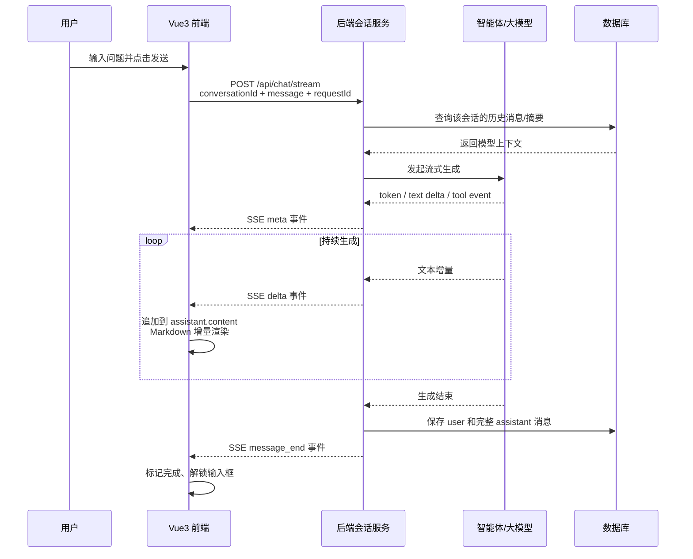

# Vue3 + SSE 流式对话：现有代码分析与手搓纲要

> 适用场景：Vue3 前端通过一次 `POST` 请求提交问题，后端把智能体生成过程以 `text/event-stream` 持续返回，前端边接收 Markdown 文本边渲染，并保存多轮对话上下文。

## 先说结论

这个项目的核心思路是：前端把 `MessageList` 作为当前会话历史，用户发送后用 `fetch` 发起 POST 请求；后端响应体不是一次性 JSON，而是一个可持续读取的字节流；前端不断读取字节、解码出文本、追加到最后一条 assistant 消息，`MdPreview` 再把不断增长的 Markdown 字符串渲染到页面。

现有项目只包含前端，没有后端源码。当前前端展示了基本方向，但还不是一个稳健的 SSE 实现：它把一次 `reader.read()` 当成一条完整 JSON、没有按 SSE 协议切帧、成功后没有解除发送锁，也只把上下文保存在页面内存中。自己手搓时应把“传输协议、消息状态、上下文存储、智能体事件映射”四件事分开设计。

---

## 一、先建立完整心智模型

SSE 流式对话不是“前后端共同修改一个 Markdown 文件”。真实过程是：

1. 用户在前端输入一段普通文本。
2. 前端向后端发送本轮问题，通常还带上 `conversationId`。
3. 后端加载历史消息，调用大模型或智能体的流式接口。
4. 大模型每生成一点内容，后端就包装成一个 SSE 事件并立即写入 HTTP 响应。
5. 前端读取 SSE 事件，把其中的 Markdown **文本片段**追加到当前 assistant 消息。
6. Vue 响应式更新触发 `MdPreview` 重新渲染，用户看到的效果就是 Markdown 一边生成一边显示。
7. 生成结束后，后端保存完整 assistant 消息并发送 `message_end` 事件。
8. 前端把消息状态改为完成，解除发送锁，并持久化需要保留的 UI 状态。



一句话区分几个容易混淆的概念：

- HTTP 流：底层连接持续返回字节。
- SSE：规定这些文本字节如何组成事件，例如 `event:`、`id:`、`data:`，每个事件以空行结束。
- JSON：可以放进 SSE 的 `data:` 字段，描述某个事件的数据。
- Markdown：assistant 生成的内容格式，本质仍是字符串，与 SSE 传输协议不是同一层。
- Vue 响应式：字符串每次追加后让页面自动重绘。

---

## 二、现有项目的真实实现

### 知识点 1：消息数组同时承担页面展示和请求上下文

文件：[src/components/Room-chat.vue](./src/components/Room-chat.vue#L41)

```js
data() {
  return {
    MessageList: [],
    char_index: 0,
    Current_ans: '',
    isTyping: false,
    typingId: null,
    isEnd: false,
    isSend: false,
  }
}
```

`MessageList` 中每条消息采用大模型常见的数据格式：

```js
{
  role: 'user' | 'assistant',
  content: '消息正文'
}
```

它有两个作用：

1. 模板用 `v-for` 把它渲染成聊天记录。
2. 请求时把整个数组 `JSON.stringify` 后发给后端，作为多轮上下文。

因此当前项目的“上下文记忆”只是 Vue 组件内存中的 `MessageList`。只要组件未卸载，下一轮请求就会携带前几轮；刷新页面后数组重新变成 `[]`，历史全部消失。它没有写入 `localStorage`、Pinia 或数据库。

### 知识点 2：用户消息和 assistant 空消息先后入列

文件：[src/components/Room-chat.vue](./src/components/Room-chat.vue#L84)

```js
handle_message(message) {
  let url = "http://localhost:8082/test"
  this.MessageList.push({
    role: "user",
    content: message
  })

  fetch(url, {
    method: 'post',
    headers: {
      "Content-Type": "application/json",
      Accept: "text/event-stream"
    },
    body: JSON.stringify(this.MessageList)
  })
}
```

整体逻辑：

1. 先把用户消息加入 `MessageList`，所以页面马上出现用户气泡。
2. 把包括当前问题在内的全部 `MessageList` 发给后端。
3. `Accept: text/event-stream` 告诉后端：“我希望收到事件流响应”。
4. `Content-Type: application/json` 表示请求体本身是 JSON。

这里采用 `fetch` 而不是浏览器原生 `EventSource`，是因为原生 `EventSource` 只方便发 GET，不能直接发送 JSON POST 请求体。聊天请求通常需要携带本轮问题、会话 ID、模型参数，因此 `fetch + response.body` 更适合。

### 知识点 3：ReadableStream 持续读取后端响应

文件：[src/components/Room-chat.vue](./src/components/Room-chat.vue#L101)

```js
.then(res => res.body)
.then(body => {
  const reader = body.getReader()
  const decoder = new TextDecoder()
  _this.MessageList.push({ role: "assistant", content: "" })

  function read() {
    return reader.read().then(({ done, value }) => {
      if (done) {
        _this.isEnd = true
        return
      }
      let data = decoder.decode(value, { stream: true })
      _this.Current_ans += JSON.parse(data).result
      if (!_this.isTyping) _this.type()
      return read()
    })
  }
  return read()
})
```

整体逻辑：

1. `res.body` 是浏览器的 `ReadableStream`。
2. `getReader()` 得到读取器。
3. 先插入一条空的 assistant 消息，后续所有文字都写进它。
4. `reader.read()` 每次返回 `{ done, value }`。
5. `value` 是 `Uint8Array` 字节，`TextDecoder` 把 UTF-8 字节转为字符串。
6. `done === true` 表示响应连接关闭，不再有数据。
7. 现有代码把每次数据中的 `result` 累加进 `Current_ans`，再启动打字机。

需要特别注意：一次 `reader.read()` 只代表“浏览器当前拿到的一块字节”，不代表“一条 SSE 事件”，更不保证是“一份完整 JSON”。TCP、代理、浏览器都有权任意拆包或合包。

例如后端写了两条事件：

```text
event: delta
data: {"content":"你"}

event: delta
data: {"content":"好"}

```

前端可能一次读到半条：

```text
event: delta\ndata: {"cont
```

也可能一次读到两条。因此不能直接对每次 `decode(value)` 的结果执行 `JSON.parse`，必须先放进字符串缓冲区，再按照 SSE 的空行边界切出完整事件。

### 知识点 4：Markdown 是“累计字符串的实时预览”

文件：[src/components/Room-chat.vue](./src/components/Room-chat.vue#L17)

```vue
<div class="chat-msg" v-if="item.role === 'assistant'">
  
  <MdPreview
    :model-value="item.content"
    class="msg-left"
  />
</div>
```

`MdPreview` 的 `model-value` 绑定 `item.content`。只要代码持续执行：

```js
assistantMessage.content += delta
```

Vue 就会更新组件，`MdPreview` 会把当前已有的完整字符串重新解析成 Markdown。后端不需要传 HTML，也不需要传 Markdown 文件，只需要传原始 Markdown 文本，例如：

````text
## 标题

这里是 **重点**。

```js
console.log('hello')
```
````

流刚开始时，Markdown 语法可能暂时不完整，例如只收到 `` ```js `` 而还没收到结尾代码围栏。预览组件可能短暂重排，这是流式 Markdown 的正常现象。

### 知识点 5：现有打字机不是 SSE 本身

文件：[src/components/Room-chat.vue](./src/components/Room-chat.vue#L65)

```js
type() {
  this.isTyping = true;
  if (this.char_index < this.Current_ans.length) {
    this.MessageList[this.MessageList.length - 1].content +=
      this.Current_ans[this.char_index];
    this.char_index++;
    this.scrollAuto();
    this.typingId = setTimeout(this.type, 20);
  } else {
    clearTimeout(this.typingId);
    this.typingId = null;
    this.isTyping = false;
  }
}
```

SSE 负责“后端边生成边传输”；`type()` 负责“前端故意每 20ms 显示一个字符”。两者可以同时存在，但不是一回事。

更简单的第一版可以收到 `delta` 后直接追加，不做打字机。因为模型本来就在流式输出，再人为逐字符排队会产生以下问题：

- 后端已经结束，前端字符队列还没有显示完。
- 数据到得比打字机消费快时，页面延迟越来越大。
- 结束状态、取消状态和下一轮消息更难管理。
- 中文 emoji 可能由多个 UTF-16 单元组成，按下标拆字符可能破坏字符。

建议先把 SSE 正确性做完，再选做“平滑显示队列”。

---

## 三、现有实现中必须认识到的问题

| 问题 | 原因 | 结果 | 手搓时的修正 |
| --- | --- | --- | --- |
| `JSON.parse(data)` 偶发报错 | 网络 chunk 不等于 JSON/SSE 事件 | 内容一长就可能解析失败 | 缓冲字符串，按空行切 SSE 帧，再解析 `data` |
| 没有真正解析 `event:`/`data:` | 当前代码假设后端只吐裸 JSON | 无法区分正文、结束、错误、工具调用 | 设计明确事件协议 |
| 成功后 `canSend` 没恢复 | 只在 `catch` 中设为 `true` | 第一轮成功后仍无法发送下一轮 | 在 `finally` 或 `message_end` 后统一解锁 |
| `isEnd` 只等连接关闭 | 没有业务结束事件 | 代理断开和正常完成无法区分 | 后端显式发送 `message_end` |
| `isEnd` 与打字机可能错过 | `done` 到达时打字机可能已经停了 | 头像/完成状态不一定更新 | 用消息自身的 `status`，结束时直接更新 |
| `Current_ans`、`char_index` 是全局变量 | 没有按消息隔离 | 多轮或并发时容易串内容 | 每条消息用唯一 `messageId` 定位 |
| 用数组最后一项接收内容 | 默认最后一项永远是当前 assistant | 并发、重试、系统消息时会写错 | 根据 `assistantMessageId` 查找 |
| `:key="index"` | 数组位置不是稳定身份 | 插入/删除消息可能导致 DOM 复用错误 | 每条消息使用稳定 `id` |
| 直接操作 DOM 换头像 | 绕过 Vue 状态系统 | 状态与 DOM 可能不同步 | 模板根据 `message.status` 选择头像 |
| 只保存在组件内存 | 没有持久化 | 刷新页面上下文丢失 | UI 缓存用 localStorage/IndexedDB，模型历史由后端数据库保存 |
| 请求未检查 `res.ok` | 404/500 也继续读 body | 报错位置模糊 | 先检查状态码和响应类型 |
| 没有取消控制 | 没保存 `AbortController` | 用户无法停止生成，切页还可能继续写状态 | 每次请求创建 controller，停止时 `abort()` |
| 跨端口没有代理配置 | 前端和 `localhost:8082` 不同源 | 依赖后端正确 CORS | 开发环境配置代理或后端 CORS |

---

## 四、推荐的前后端接口契约

### 4.1 请求：只发本轮输入和会话身份

推荐接口：

```http
POST /api/chat/stream
Content-Type: application/json
Accept: text/event-stream
```

推荐请求体：

```json
{
  "conversationId": "conv_123",
  "requestId": "req_456",
  "message": "请解释一下 SSE",
  "parentMessageId": "msg_100"
}
```

字段职责：

- `conversationId`：后端用它加载会话历史，是长期上下文的主键。
- `requestId`：本次生成的幂等键，断线重试时避免重复创建消息。
- `message`：本轮用户输入。
- `parentMessageId`：可选，用于重试、分支对话或校验消息顺序。

初学版也可以继续把完整 `messages` 传给后端，但正式项目更推荐“前端发 `conversationId + 本轮问题`，后端掌管真实历史”。原因是前端传来的历史可以被篡改、消息越来越大、多端之间也难同步。

### 4.2 响应头：告诉浏览器和代理不要缓存、不要攒包

```http
HTTP/1.1 200 OK
Content-Type: text/event-stream; charset=utf-8
Cache-Control: no-cache, no-transform
Connection: keep-alive
X-Accel-Buffering: no
```

说明：

- `text/event-stream`：这是 SSE 响应。
- `no-cache`：不要缓存事件流。
- `no-transform`：尽量避免中间层转换或压缩响应。
- `X-Accel-Buffering: no`：使用 Nginx 时关闭响应缓冲。
- 后端每写完一个事件要及时 flush；否则代码虽然逐条生成，网络仍可能攒成一大块才到前端。

### 4.3 事件：一个事件以空行结束

推荐协议示例：

```text
id: 1
event: meta
data: {"conversationId":"conv_123","assistantMessageId":"msg_102"}

id: 2
event: delta
data: {"content":"## SSE"}

id: 3
event: delta
data: {"content":"\n\nSSE 是服务器向浏览器持续推送数据的机制。"}

id: 4
event: message_end
data: {"finishReason":"stop","usage":{"inputTokens":120,"outputTokens":48}}

```

最后那一行空行是协议的一部分。建议不要把 `[DONE]` 和 JSON 混用；统一使用有名字的 `message_end` 事件更清晰。

### 4.4 智能体场景建议保留的事件类型

| `event` | 何时发送 | 前端动作 |
| --- | --- | --- |
| `meta` | 后端创建会话/assistant 消息后 | 保存 `conversationId`、服务端消息 ID |
| `message_start` | 智能体准备开始回答 | 把消息状态设为 `streaming` |
| `delta` | 模型返回一段可展示文本 | 追加到 `assistant.content` |
| `reasoning_delta` | 产品允许展示思考摘要时 | 写入独立区域，不要混入正文 |
| `tool_start` | 智能体开始调用搜索、数据库等工具 | 显示“正在搜索”等状态 |
| `tool_delta` | 工具返回增量进度 | 更新工具卡片 |
| `tool_end` | 工具执行结束 | 标记工具步骤完成 |
| `citation` | 返回引用来源 | 更新引用列表 |
| `message_end` | 模型完整结束且服务端已收尾 | 标记完成、解锁输入框 |
| `error` | 响应已开始后发生业务错误 | 标记失败、展示可重试提示 |
| `ping` | 长时间没有模型内容时 | 保活，不渲染为消息 |

不是所有事件第一版都要做。最小可用协议只需：`meta`、`delta`、`message_end`、`error`。

---

## 五、Vue3 前端手搓流程

下面按 Composition API 描述。即使继续使用 Options API，状态和步骤也完全相同。

### 第 1 步：先定义消息状态，不要只存 role 和 content

```js
const messages = ref([])
const isGenerating = ref(false)
const activeController = shallowRef(null)

// 一条前端消息建议至少包含：
// id：稳定定位消息，不能用数组下标代替。
// role：user 或 assistant。
// content：完整 Markdown 字符串。
// status：sending、streaming、done、error、aborted。
// error：失败时保存可展示的信息。
```

建议结构：

```js
{
  id: 'local_xxx',
  serverId: null,
  role: 'assistant',
  content: '',
  status: 'streaming',
  error: null,
  createdAt: Date.now()
}
```

注释逻辑可以直接写成：

```js
// 消息必须有稳定 id，因为流式返回期间要持续定位并更新同一条 assistant 消息。
// status 用来驱动 loading、停止、失败和完成 UI，避免直接操作 DOM。
```

### 第 2 步：发送前先做同步状态

```js
// 1. 去掉输入首尾空格，空内容不发送。
// 2. 如果已有请求正在生成，则阻止重复发送。
// 3. 立刻插入 user 消息，让界面马上反馈。
// 4. 再插入一条空 assistant 消息，后续 delta 都追加到这一条。
// 5. 保存 assistantMessageId，不能默认永远更新数组最后一项。
// 6. 设置 isGenerating=true，并创建 AbortController。
```

### 第 3 步：发起 POST 流式请求

```js
const response = await fetch('/api/chat/stream', {
  method: 'POST',
  headers: {
    'Content-Type': 'application/json',
    Accept: 'text/event-stream'
  },
  body: JSON.stringify({
    conversationId: conversationId.value,
    requestId,
    message: question
  }),
  signal: controller.signal
})

if (!response.ok) {
  throw new Error(`请求失败：HTTP ${response.status}`)
}

if (!response.body) {
  throw new Error('当前浏览器或响应不支持流式读取')
}
```

如果前后端分端口开发，建议 Vue 开发服务器代理 `/api`，线上再由同域网关转发。这样比在组件里硬编码 `http://localhost:8082` 更容易部署。

### 第 4 步：写一个真正的 SSE 切帧器

最重要的原则：**按 SSE 空行边界切事件，不按 `reader.read()` 切事件。**

```js
function parseSseFrame(frame) {
  let event = 'message'
  let id = ''
  const dataLines = []

  for (const line of frame.split('\n')) {
    // 冒号开头是 SSE 注释，通常用于心跳，业务层可以忽略。
    if (line.startsWith(':')) continue

    const colonIndex = line.indexOf(':')
    const field = colonIndex === -1 ? line : line.slice(0, colonIndex)
    let value = colonIndex === -1 ? '' : line.slice(colonIndex + 1)
    if (value.startsWith(' ')) value = value.slice(1)

    if (field === 'event') event = value
    if (field === 'id') id = value
    if (field === 'data') dataLines.push(value)
  }

  return {
    event,
    id,
    // SSE 允许一个事件有多行 data，需要用换行拼回去。
    data: dataLines.join('\n')
  }
}
```

读取循环：

```js
async function consumeSse(response, onEvent) {
  const reader = response.body.getReader()
  const decoder = new TextDecoder('utf-8')
  let buffer = ''

  while (true) {
    const { value, done } = await reader.read()

    if (done) {
      // 把 TextDecoder 内部尚未输出的残余字节冲出来。
      buffer += decoder.decode()
      break
    }

    // stream:true 能正确处理一个中文字符的 UTF-8 字节被拆到两块的情况。
    buffer += decoder.decode(value, { stream: true })

    // 同时兼容后端使用 CRLF 和 LF；统一后再按空行切完整事件。
    buffer = buffer.replace(/\r\n/g, '\n')

    let boundaryIndex
    while ((boundaryIndex = buffer.indexOf('\n\n')) !== -1) {
      const frame = buffer.slice(0, boundaryIndex)
      buffer = buffer.slice(boundaryIndex + 2)

      if (!frame.trim()) continue
      onEvent(parseSseFrame(frame))
    }
  }

  // 正常协议应该用空行结束最后一帧；保留检查便于发现不规范后端。
  if (buffer.trim()) {
    onEvent(parseSseFrame(buffer))
  }
}
```

### 第 5 步：分发事件，不要把所有数据都当正文

```js
function handleStreamEvent(sseEvent, assistantMessageId) {
  // 根据稳定 id 找到本次生成对应的 assistant 消息。
  const target = messages.value.find(item => item.id === assistantMessageId)
  if (!target) return

  // 空 data（例如纯心跳）不执行 JSON.parse。
  const payload = sseEvent.data ? JSON.parse(sseEvent.data) : {}

  switch (sseEvent.event) {
    case 'meta':
      conversationId.value = payload.conversationId
      target.serverId = payload.assistantMessageId
      break

    case 'message_start':
      target.status = 'streaming'
      break

    case 'delta':
      // content 是 Markdown 原文片段，必须追加，不能覆盖。
      target.content += payload.content ?? ''
      scrollToBottom()
      break

    case 'message_end':
      target.status = 'done'
      break

    case 'error':
      target.status = 'error'
      target.error = payload.message || '生成失败'
      break

    case 'ping':
      // 心跳只用于保持连接，不写入聊天正文。
      break
  }
}
```

注意：不要对每个 `delta` 直接执行 `messages.value = [...messages.value]` 创建整份新数组。Vue3 能追踪对象属性变化，直接追加目标消息的 `content` 即可。

### 第 6 步：把发送、异常和收尾放进一个完整生命周期

```js
async function sendMessage(rawQuestion) {
  const question = rawQuestion.trim()
  if (!question || isGenerating.value) return

  const requestId = crypto.randomUUID()
  const assistantMessageId = `local_${crypto.randomUUID()}`
  const controller = new AbortController()

  messages.value.push({
    id: `local_${crypto.randomUUID()}`,
    role: 'user',
    content: question,
    status: 'done',
    createdAt: Date.now()
  })

  messages.value.push({
    id: assistantMessageId,
    role: 'assistant',
    content: '',
    status: 'streaming',
    error: null,
    createdAt: Date.now()
  })

  isGenerating.value = true
  activeController.value = controller

  try {
    const response = await fetch('/api/chat/stream', {
      method: 'POST',
      headers: {
        'Content-Type': 'application/json',
        Accept: 'text/event-stream'
      },
      body: JSON.stringify({
        conversationId: conversationId.value,
        requestId,
        message: question
      }),
      signal: controller.signal
    })

    if (!response.ok) throw new Error(`HTTP ${response.status}`)
    if (!response.body) throw new Error('响应体不可流式读取')

    await consumeSse(response, event => {
      handleStreamEvent(event, assistantMessageId)
    })
  } catch (error) {
    const target = messages.value.find(item => item.id === assistantMessageId)

    if (target) {
      if (error.name === 'AbortError') {
        target.status = 'aborted'
      } else {
        target.status = 'error'
        target.error = error.message || '请求失败'
      }
    }
  } finally {
    // 无论正常结束、业务报错、网络断开还是主动停止，都必须恢复交互状态。
    isGenerating.value = false
    activeController.value = null
    persistUiMessages()
  }
}
```

补充判断：如果连接直接关闭但始终没有收到 `message_end`，应将消息标为 `error` 或 `interrupted`，不要默认为成功。可以用布尔值 `receivedMessageEnd` 记录是否真的收到业务结束事件。

### 第 7 步：实现停止生成

```js
function stopGenerating() {
  // abort 会让 fetch 抛出 AbortError，统一交给 catch/finally 收尾。
  activeController.value?.abort()
}
```

如果后端在检测到客户端断开后能取消模型任务，也应同步取消，以免继续消耗 token。仅在浏览器中 `abort()` 不保证所有后端框架都会自动停止上游模型，需要后端监听连接取消信号。

### 第 8 步：增量渲染 Markdown

模板可以保持简单：

```vue
<article
  v-for="message in messages"
  :key="message.id"
  :class="['message', message.role]"
>
  <MdPreview
    v-if="message.role === 'assistant'"
    :model-value="message.content"
  />
  <div v-else>{{ message.content }}</div>

  <span v-if="message.status === 'streaming'">生成中…</span>
  <span v-if="message.status === 'error'">{{ message.error }}</span>
</article>
```

Markdown 注意事项：

1. 后端只传 Markdown 原文，不传已经拼好的 DOM。
2. 不要自己用 `v-html` 直接渲染模型返回内容；如果开启原始 HTML，必须做 XSS 清洗。
3. 高频 token 会让 Markdown 组件高频重解析。流量大时可把多个 delta 暂存起来，每 16～50ms 批量追加一次。
4. 自动滚动应尊重用户行为：用户主动向上查看历史时，不要强行拉到底部。

---

## 六、前端上下文记忆到底怎样保存

上下文其实有三层，不能只说“存 Pinia”或“存 localStorage”。

### 6.1 页面运行时记忆

位置：Vue `ref/reactive` 或 Pinia。

用途：当前页面展示、流式追加、按钮状态。刷新即丢失是正常的。

```js
const messages = ref([])
const conversationId = ref(null)
```

现有项目的 `MessageList` 就属于这一层。

### 6.2 浏览器 UI 缓存

位置：

- 少量、简单数据：`localStorage`。
- 多会话、大消息、附件或检索结果：IndexedDB。

用途：刷新后快速恢复聊天画面，不应作为后端模型上下文的唯一可信来源。

简单版本：

```js
const STORAGE_KEY = 'chat-ui-cache:v1'

function persistUiMessages() {
  localStorage.setItem(STORAGE_KEY, JSON.stringify({
    conversationId: conversationId.value,
    messages: messages.value
  }))
}

function restoreUiMessages() {
  const raw = localStorage.getItem(STORAGE_KEY)
  if (!raw) return

  try {
    const cache = JSON.parse(raw)
    conversationId.value = cache.conversationId ?? null
    messages.value = Array.isArray(cache.messages) ? cache.messages : []
  } catch {
    localStorage.removeItem(STORAGE_KEY)
  }
}
```

安全提醒：聊天内容可能含敏感信息。共享设备、强合规系统不应默认把完整内容长期放在 localStorage；可以只存 `conversationId`，页面恢复时从后端重新查询。

### 6.3 后端模型上下文

这是决定智能体“记不记得”的真正一层。推荐由后端数据库保存：

```text
conversation
  id
  user_id
  title
  summary
  created_at
  updated_at

message
  id
  conversation_id
  role
  content
  status
  request_id
  token_count
  created_at
```

每轮流程：

1. 校验当前用户是否有权访问 `conversationId`。
2. 用 `requestId` 做幂等检查，防止重复提交。
3. 保存本轮 user 消息。
4. 查询系统提示词、会话摘要和最近若干条消息。
5. 根据模型上下文窗口做 token 预算，不能无限把全部历史塞给模型。
6. 调用智能体流式接口。
7. 把所有正文 delta 累计成完整 assistant 内容。
8. 正常结束后保存 assistant 消息和 token 用量。
9. 历史过长时生成/更新摘要，后续使用“摘要 + 最近消息”。

推荐的上下文拼装顺序：

```text
system prompt
长期记忆/用户偏好（如确有需要）
旧对话摘要
最近 N 轮原始消息
本轮 user 消息
```

不要把“聊天列表能在页面看见”误认为“模型已经记住”。只有后端最终送进模型请求的内容才是模型本轮可见的上下文。

---

## 七、后端如何把智能体返回转换为 eventStream

### 7.1 后端的职责边界

后端不要把大模型供应商的原始事件不加处理地直接透传给浏览器。更稳妥的做法是增加一层适配器：

```text
供应商 A token 事件 ─┐
供应商 B chunk 事件 ─┼─> AgentStreamAdapter ─> 统一的业务 SSE 事件
自研工具调用事件 ───┘
```

好处：前端只认识 `delta/tool_start/message_end/error`，以后切模型供应商不需要改 UI。

### 7.2 后端最小处理步骤

下面这段可以直接改写成后端方法注释：

```text
1. 接收 conversationId、requestId 和本轮 message。
2. 校验登录用户、会话归属、请求参数和并发状态。
3. 通过 requestId 做幂等判断，避免重试产生重复回答。
4. 保存 user 消息，创建 status=streaming 的 assistant 消息记录。
5. 设置 text/event-stream 响应头并立即发送 meta/message_start。
6. 从数据库加载摘要和最近历史，按 token 预算拼装模型 messages。
7. 调用智能体的流式生成接口，订阅其增量回调。
8. 文本增量：累加到服务端 StringBuilder，同时发送 delta SSE。
9. 工具调用：转换为 tool_start/tool_delta/tool_end，不能混进 Markdown 正文。
10. 定时发送 ping，避免代理因长时间无数据关闭连接。
11. 智能体正常结束：保存完整 assistant 正文和 usage，再发送 message_end。
12. 智能体失败：把消息记录改成 error，并发送 error SSE。
13. 客户端断开：取消上游智能体订阅，释放连接、线程和计费资源。
14. 所有路径都要收尾，避免数据库一直残留 streaming 状态。
```

### 7.3 框架无关伪代码

```js
async function streamChat(request, response) {
  validateRequest(request)
  const context = await loadContext(request.conversationId)
  const assistant = await createStreamingMessage(request.requestId)

  initSseHeaders(response)
  sendSse(response, 'meta', {
    conversationId: context.id,
    assistantMessageId: assistant.id
  })
  sendSse(response, 'message_start', {})

  let fullText = ''

  try {
    for await (const agentEvent of agent.stream(context)) {
      if (agentEvent.type === 'text_delta') {
        fullText += agentEvent.text
        sendSse(response, 'delta', { content: agentEvent.text })
      }

      if (agentEvent.type === 'tool_start') {
        sendSse(response, 'tool_start', normalizeToolEvent(agentEvent))
      }

      if (agentEvent.type === 'tool_end') {
        sendSse(response, 'tool_end', normalizeToolEvent(agentEvent))
      }
    }

    // 先确保完整消息已保存，再告诉前端完成。
    await completeAssistantMessage(assistant.id, fullText)
    sendSse(response, 'message_end', { finishReason: 'stop' })
  } catch (error) {
    await failAssistantMessage(assistant.id, error)
    sendSse(response, 'error', { message: safeErrorMessage(error) })
  } finally {
    response.end()
  }
}
```

### 7.4 正确写出一条 SSE

框架最终做的事情应等价于：

```js
function sendSse(response, eventName, payload, id) {
  if (id) response.write(`id: ${id}\n`)
  response.write(`event: ${eventName}\n`)
  response.write(`data: ${JSON.stringify(payload)}\n\n`)
  response.flush?.()
}
```

关键点：

- 每个事件最后是两个换行，即一个空行。
- payload 先 JSON 序列化，JSON 内部的换行会被转义。
- 不要手拼不受控的用户字符串，否则换行可能破坏 SSE 帧。
- 响应一旦已经以 200 开始流出，后续异常通常不能再改 HTTP 状态码，应通过 `event: error` 通知前端。

### 7.5 如果后端是 Spring Boot

两种常见实现：

- Spring MVC：`SseEmitter`，适合现有 Servlet 项目，但要正确管理异步线程、超时与 `onCompletion/onError/onTimeout`。
- Spring WebFlux：`Flux<ServerSentEvent<T>>`，如果模型 SDK 本身返回 `Flux`，链路更自然，也更容易传播取消信号。

WebFlux 方法轮廓：

```java
@PostMapping(
    value = "/api/chat/stream",
    produces = MediaType.TEXT_EVENT_STREAM_VALUE
)
public Flux<ServerSentEvent<ChatEvent>> stream(@RequestBody ChatRequest request) {
    return chatService.stream(request)
        .map(event -> ServerSentEvent.<ChatEvent>builder()
            .event(event.type())
            .id(event.id())
            .data(event)
            .build());
}
```

这只是控制器边界，真正重要的是 `chatService.stream` 必须完成历史加载、agent 事件转换、消息累计保存、错误收尾和取消传播。不要在控制器里堆所有业务逻辑。

---

## 八、智能体 eventStream 应如何映射

智能体返回通常不只有文字。一个可靠映射流程如下：

### 文本增量

智能体事件：

```json
{"type":"text_delta","text":"SSE 是"}
```

对浏览器输出：

```text
event: delta
data: {"content":"SSE 是"}

```

后端同时做：

```text
fullText = fullText + "SSE 是"
```

### 工具调用

智能体要搜索资料时，不应把工具参数和工具原始结果直接拼进 Markdown 正文。应映射成独立事件：

```text
event: tool_start
data: {"toolCallId":"tool_1","name":"web_search","displayName":"正在搜索资料"}

event: tool_end
data: {"toolCallId":"tool_1","status":"success"}

```

前端可用工具卡片展示，正文仍只消费 `delta`。

### 结束

智能体的“模型流结束”不一定等于“整条业务成功”。后端最好按这个顺序：

1. 收到模型完成信号。
2. 停止心跳。
3. 保存完整 assistant 正文、引用、工具记录和 token 使用量。
4. 数据库事务成功。
5. 向前端发送 `message_end`。
6. 关闭响应。

这样前端收到 `message_end` 时，可以认为服务端已经完成持久化。

### 错误

建议错误 payload 只返回安全信息：

```text
event: error
data: {"code":"MODEL_TIMEOUT","message":"生成超时，请重试","retryable":true}

```

不要把供应商密钥、完整堆栈、内部提示词或数据库错误直接发给浏览器。

---

## 九、一轮对话的逐行注释纲要

下面是最适合直接贴进自己代码顶部的版本。

### 前端发送函数注释

```js
// 1. 校验输入：去除首尾空格，空消息直接返回。
// 2. 校验生成状态：上一轮未结束时不允许重复发送。
// 3. 创建 requestId：用于后端幂等和问题追踪。
// 4. 创建 userMessage：立即加入消息数组，让用户马上看到自己的问题。
// 5. 创建空 assistantMessage：status 设为 streaming，后续流片段都写入该消息。
// 6. 记录 assistantMessageId：流式期间始终按 id 查找消息，不能依赖数组最后一项。
// 7. 创建 AbortController：允许用户主动停止生成，组件卸载时也能取消请求。
// 8. 发起 POST /api/chat/stream：请求体传 conversationId、requestId、本轮 message。
// 9. 检查 HTTP 状态和 response.body：失败时尽早抛出明确错误。
// 10. 循环读取响应字节：TextDecoder 使用 stream:true 防止中文被截断。
// 11. 把解码文本加入 buffer：网络 chunk 不能直接当完整事件解析。
// 12. 按空行从 buffer 中切出完整 SSE 帧，未完成部分留到下一次读取。
// 13. 解析 event/id/data：data 多行时用换行拼回，之后才 JSON.parse。
// 14. meta：保存后端 conversationId 和 assistantMessageId。
// 15. delta：把 payload.content 追加到目标 assistant.content，触发 Markdown 渲染。
// 16. tool 事件：更新独立工具状态，不混进正文。
// 17. message_end：记录业务正常结束，消息状态改为 done。
// 18. error：消息状态改为 error，展示安全且可操作的提示。
// 19. 网络流关闭：若未收到 message_end，应按中断处理，不能冒充成功。
// 20. catch：区分 AbortError 与真实异常，分别标记 aborted 或 error。
// 21. finally：无论成功失败都解除发送锁、清理 controller、保存必要的 UI 缓存。
```

### 后端流式接口注释

```java
// 1. 校验登录态、会话归属、message 内容和 requestId。
// 2. 通过 requestId 做幂等判断，防止前端重试产生重复消息。
// 3. 保存 user 消息，并创建 status=streaming 的 assistant 消息记录。
// 4. 设置 text/event-stream、no-cache 和关闭代理缓冲相关响应头。
// 5. 立即发送 meta/message_start，让前端获得真实会话和消息 ID。
// 6. 查询系统提示词、会话摘要和最近历史消息。
// 7. 按模型 token 上限裁剪上下文，不能无限携带全部历史。
// 8. 调用智能体流式接口，并监听文本、工具、完成、错误和取消事件。
// 9. 文本事件：追加到 fullText，同时转换成 delta SSE 并及时 flush。
// 10. 工具事件：转换成 tool_start/tool_end，正文与工具状态分离。
// 11. 长时间无内容时发送 ping，防止网关或代理关闭空闲连接。
// 12. 正常结束：先持久化完整 assistant、usage 和引用，再发送 message_end。
// 13. 异常结束：更新消息状态为 error，再发送安全的 error SSE。
// 14. 客户端断开：取消智能体上游任务，停止心跳并释放资源。
// 15. 最终关闭响应；所有分支都不能留下永久 streaming 状态。
```

### 上下文管理注释

```text
1. Vue/Pinia 只负责当前页面运行时消息状态。
2. localStorage/IndexedDB 只负责刷新后的 UI 恢复，不作为可信业务数据源。
3. 后端数据库按 conversationId 保存真实消息历史。
4. 前端每轮只传 conversationId 和本轮 message，后端负责加载上下文。
5. 历史过长时使用“旧消息摘要 + 最近 N 轮”，并按 token 数而不是数组长度裁剪。
6. 只有真正传给模型的 messages 才是模型本轮拥有的记忆。
```

---

## 十、建议的实现顺序

不要一开始同时加入打字机、工具卡片、断线重连和长期记忆。按下面顺序手搓最容易定位问题。

### 阶段 1：只打通一条纯文本流

1. 后端固定每 300ms 发送一个 `delta`，最后发送 `message_end`。
2. 前端实现缓冲区切帧和事件分发。
3. 暂时不接大模型、不做 Markdown、不存数据库。
4. 验证中文、换行、一个 chunk 多事件、一个事件跨 chunk。

### 阶段 2：接入 Markdown

1. assistant `content += delta`。
2. 用 `MdPreview` 渲染完整累计字符串。
3. 测试标题、列表、粗体、长代码块和未闭合代码围栏。
4. 做基础 XSS 策略和渲染节流。

### 阶段 3：接入真实模型/智能体

1. 用适配器把供应商的文本增量转换成 `delta`。
2. 收集完整正文并在结束时保存。
3. 将工具调用拆成独立事件。
4. 加入超时、取消和安全错误信息。

### 阶段 4：加入多轮上下文

1. 创建 conversation/message 表。
2. 前端保存 `conversationId`。
3. 后端根据会话加载历史。
4. 加入 token 预算、历史裁剪和摘要。
5. 页面刷新时从后端加载会话记录。

### 阶段 5：做生产可靠性

1. Nginx/网关关闭缓冲，确认超时时间。
2. 空闲期间发送心跳。
3. `requestId` 幂等，避免重试重复扣费和重复消息。
4. 用户停止或断开时取消上游智能体。
5. 建立日志字段：userId、conversationId、requestId、messageId、模型、耗时、token。
6. 做限流、鉴权、会话权限和输出安全控制。

---

## 十一、必须亲手测试的场景

### 协议解析

- 一条 SSE 事件被故意拆成 2～5 个网络 chunk，仍能正确解析。
- 多条 SSE 事件一次到达，全部被逐条处理。
- 中文字符的 UTF-8 字节跨 chunk，不出现乱码。
- `data:` 中含 JSON 转义换行、引号、反斜杠，仍能解析。
- CRLF（`\r\n`）和 LF（`\n`）都能处理。
- 心跳注释或 `ping` 不会显示在正文中。

### 生命周期

- 正常收到 `message_end` 后按钮恢复。
- HTTP 400/401/500 时产生明确错误。
- 已经开始流式后后端发送 `error`，消息正确标红。
- 网络中途断开且没有 `message_end`，状态是 interrupted/error，不是 done。
- 用户点击停止，前端为 aborted，后端也停止模型任务。
- 组件卸载时取消请求，不再修改已销毁组件。

### 上下文

- 第二轮提问能引用第一轮信息。
- 刷新后能恢复 conversationId 和历史画面。
- 用户不能通过修改 conversationId 读取他人会话。
- 超长会话经过裁剪/摘要后仍不超过模型上下文窗口。
- 重复 requestId 不会创建两条相同回答。

### Markdown

- 长代码块在生成中和生成后都能正常显示。
- 模型返回 HTML/script 风格内容时不会执行恶意脚本。
- 高频 delta 不会让页面明显卡顿。
- 用户上滑看历史时不会被自动滚动强行拉回底部。

---

## 十二、面试或复盘时可以这样讲

“这个流式对话使用的是 POST 加 SSE 响应流。POST 用来提交会话 ID 和本轮问题，后端以 `text/event-stream` 返回统一事件。前端通过 `ReadableStream.getReader()` 读取字节，但不会把一个网络 chunk 当成一条消息，而是用 `TextDecoder` 和字符串 buffer 按 SSE 空行切帧。`delta` 事件会根据稳定的 messageId 追加到同一条 assistant 消息，Vue 再把累计字符串交给 Markdown 组件实时渲染；`message_end`、`error` 和工具调用走独立事件。上下文方面，Vue/Pinia 只保存运行时状态，浏览器缓存用于恢复 UI，真正给模型使用的历史由后端按 conversationId 从数据库加载，并通过摘要和 token 预算控制长度。”

常见追问：

1. **为什么不用 EventSource？** 原生 EventSource 主要是 GET，而聊天需要用 POST 携带 JSON；所以使用 fetch 读取 SSE 格式的响应流。
2. **为什么不能直接 JSON.parse 每个 chunk？** chunk 是传输层任意分块，可能包含半条或多条事件；必须先按协议边界组帧。
3. **SSE 和 WebSocket 如何选？** 聊天生成主要是服务器单向推送，SSE 基于普通 HTTP、实现和代理配置较简单；需要持续双向高频通信时再考虑 WebSocket。
4. **Markdown 为什么能流式？** 不是流式传文件，而是持续追加 Markdown 原文字符串，响应式 UI 每次重新解析当前完整内容。
5. **模型的记忆存在前端吗？** 前端只是展示/缓存；模型的真实上下文是后端每轮拼装并发送给模型的消息。
6. **如何判断真的生成成功？** 不能只看 TCP 连接关闭，必须收到业务层 `message_end`，并且最好由后端在持久化成功后再发送。

---

## 十三、针对当前仓库最优先的修改点

如果要在这个项目上继续改，推荐顺序是：

1. 把 [Room-chat.vue](./src/components/Room-chat.vue#L108) 中的 `reader.read()` 递归读取改为“buffer + SSE 空行切帧”。
2. 取消全局 `Current_ans/char_index`，收到 `delta` 后按 assistant 消息 ID 直接追加正文。
3. 给每条消息增加 `id` 和 `status`，模板的 `:key` 从数组下标改成消息 ID。
4. 用响应式 `status` 切换加载头像，不再 `document.getElementsByClassName` 操作 DOM。
5. 在 `finally` 中恢复发送状态；当前 [send-input.vue](./src/components/send-input.vue#L118) 只锁定，没有在成功路径解锁。
6. 增加 `conversationId + requestId`，后端保存真实上下文。
7. 最后再决定是否保留打字机；第一版直接展示 SSE delta 更容易保证正确。

做到这里，SSE 流、Markdown 增量渲染、前端 UI 记忆、后端模型记忆和智能体事件流就形成了一条完整且可验证的链路。
